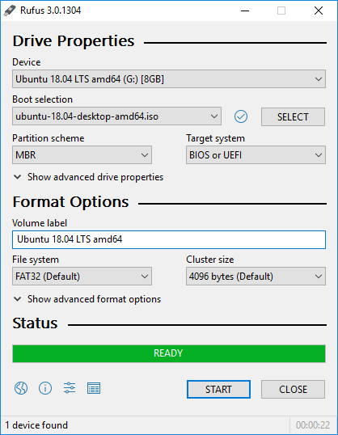
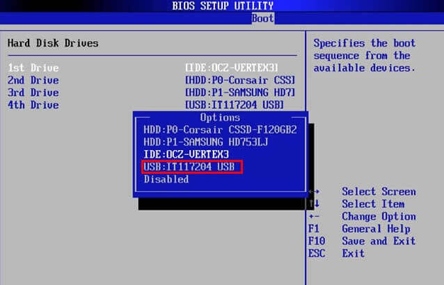
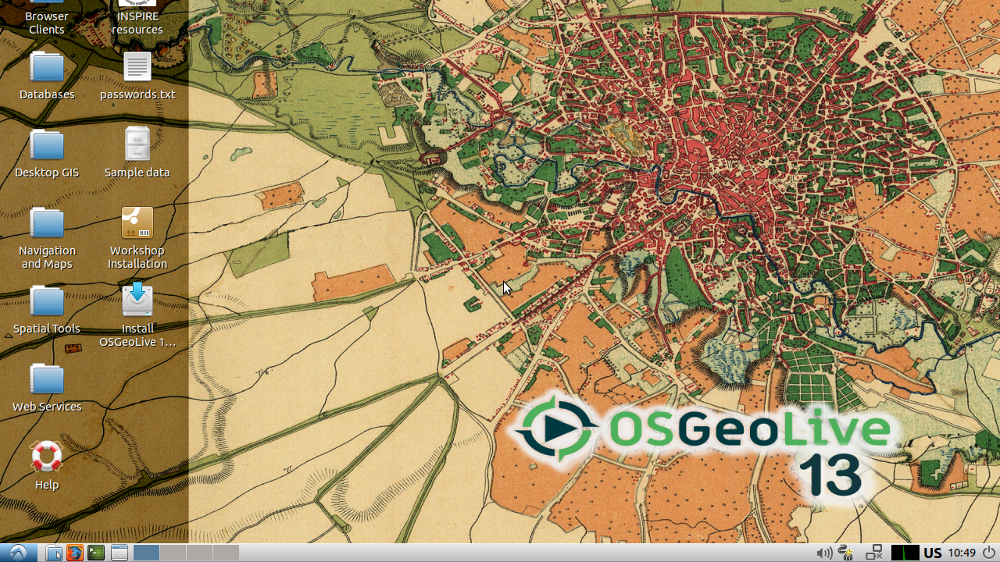

# Free and Open Source Software-GIS

Saat Anda sedang membaca panduan ini, barangkali dapat kita asumsikan bahwa Anda saat ini menggunakan sistem operasi Windows 10, dengan beberapa perangkat lunak GIS berbayar maupun open source di dalamnya. Pada bagian ini akan dibahas mengenai perangkat lunak 'bebas dan terbuka' (Free and Open Source) yang difungsikan khususnya untuk aplikasi di bidang Informasi Geospasial.

 
## Mengenal Lisensi Perangkat Lunak OpenSource
Seringkali terdapat kesalah-pahaman mengenai aplikasi Open Source. Banyak yang menganggap bahwa apabila suatu perangkat lunak diberi label 'opensource' maka dengan sendirinya aplikasi tersebut akan gratis alias tidak berbayar. Pada bagian ini akan dijelaskan secara singkat mengenai pengertian free dan opensource, serta bagaimana pembangun aplikasi (developer) menerapkan dan memilih lisensi perangkat lunak ini.

### Free as in `Free-Speech` dan `Free-Drinks`
Perangkat lunak gratis atau 'free' mengindikasikan bahwa kita tidak perlu membayar biaya apapun pada saat menggunakan perangkat lunak ini. Meskipun demikian, tidak semua perangkat lunak gratis adalah open source. Demikian juga sebaliknya, tidak semua aplikasi yang bersifat open source maka dengan sendirinya akan menjadi gratis.

Pada bagian mengenai sejarah Linux seperti yang kita jumpai di bagian awal buku ini, terdapat pembahasan mengenai bagaimana Kernel Linux yang dikembangkan oleh Linus Torvalds kemudian dapat digunakan secara bebas oleh siapapun, dimana setiap orang bebas membuat copy, memodifikasi, merilis Linux dengan versinya sendiri, bahkan memungut biaya untuk kode yang telah dimodifikasinya (seperti pada ElementaryOS). Hal ini dimungkinkan karena Linus memberikan lisensi [GNU/GPL versi 2.0 (GPL-2.0)](https://www.gnu.org/licenses/old-licenses/gpl-2.0.en.html), sebagaimana diterbitkan oleh Free Software Foundation yang mengatur hal-hal tersebut di atas. Bagaimana jika Linus, misalnya, meminta satu dollar untuk tiap penggunaan kernel tersebut? atau ia melarang orang lain untuk mendistribusikan ulang kernel Linux yang dimilikinya, atau melakukan hal-hal lain seperti yang dapat dilakukan pada kode tersebut di atas secara cuma-cuma?

Perlu dipahami bahwa 'Free' tidak selalu berarti aplikasi tersebut bebas untuk digunakan apa saja. Terdapat perbedaan antara pengertian `free as in free beer` dan `free as in free speech`: **gratis** berbeda dengan **bebas**. "*Free as in free beer*" mengacu pada biaya (yaitu uang) yang harus dikeluarkan untuk menggunakan perangkat lunak tersebut, sedangkan "*free as in free speech*" mengacu pada apa yang boleh Anda lakukan dengan perangkat lunak tersebut. Dalam pengembangan perangkat lunak, dimana biaya produksi massal relatif kecil, biasanya pengembang memang menyediakan perangkat lunak tanpa biaya. Richard Stallman, perintis GNU, merupakan pelopor lisensi bebas terbuka ini, yang kemudian membuka pintu untuk pengembangan Linux oleh Linus Torvalds.

```{figure} img/2020-12-07-13-34-29.png
---
height: 500px
name: freebeear
---
"Think Free Speech, not Free Beer"
```

> "**'Free software' is a matter of liberty, not price. To understand the concept, you should think of "free" as in "free speech", not as in "free beer"**."
> 
> (**Free Software Definition, Richard Stallman**)

Terdapat 10 faktor berbeda yang mendefinisikan mengenai penggunaan perangkat lunak open source sebagaimana dijelaskan dalam [OSD (Open Source Definition)](https://opensource.org/docs/osd):

```{admonition} Catatan
Bagian ini tidak diterjemahkan agar tidak merubah makna
```


1. **Free Redistribution** &nbsp;  
   The license shall not restrict any party from selling or giving away the software as a component of an aggregate software distribution containing programs from several different sources. The license shall not require a royalty or other fee for such sale.

2. **Source Code** &nbsp;  
   The program must include source code, and must allow distribution in source code as well as compiled form. Where some form of a product is not distributed with source code, there must be a well-publicized means of obtaining the source code for no more than a reasonable reproduction cost, preferably downloading via the Internet without charge. The source code must be the preferred form in which a programmer would modify the program. Deliberately obfuscated source code is not allowed. Intermediate forms such as the output of a preprocessor or translator are not allowed.

3. **Derived Works** &nbsp;  
   The license must allow modifications and derived works, and must allow them to be distributed under the same terms as the license of the original software.

4. **Integrity of The Author's Source Code** &nbsp;  
   The license may restrict source-code from being distributed in modified form only if the license allows the distribution of "patch files" with the source code for the purpose of modifying the program at build time. The license must explicitly permit distribution of software built from modified source code. The license may require derived works to carry a different name or version number from the original software.

5. **No Discrimination Against Persons or Groups** &nbsp;  
   The license must not discriminate against any person or group of persons.

6. **No Discrimination Against Fields of Endeavor** &nbsp;  
   The license must not restrict anyone from making use of the program in a specific field of endeavor. For example, it may not restrict the program from being used in a business, or from being used for genetic research.

7. **Distribution of License** &nbsp;  
   The rights attached to the program must apply to all to whom the program is redistributed without the need for execution of an additional license by those parties.

8. **License Must Not Be Specific to a Product** &nbsp;  
   The rights attached to the program must not depend on the program's being part of a particular software distribution. If the program is extracted from that distribution and used or distributed within the terms of the program's license, all parties to whom the program is redistributed should have the same rights as those that are granted in conjunction with the original software distribution.

9.  **License Must Not Restrict Other Software** &nbsp;  
    The license must not place restrictions on other software that is distributed along with the licensed software. For example, the license must not insist that all other programs distributed on the same medium must be open-source software.

10. **License Must Be Technology-Neutral** &nbsp;  
    No provision of the license may be predicated on any individual technology or style of interface.


Perbedaan penggunaan definisi dari lisensi tersebut memberikan ruang bagi pengembang untuk memilih lisensi yang sesuai dengan kebutuhannya, sebagaimana penjelasan di bawah ini:


### Lisensi Perangkat Lunak
Sebagaimana disebutkan di atas, pengembang aplikasi menggunakan lisensi untuk mendefinisikan batasan apa yang boleh dan tidak boleh dilakukan terhadap perangkat lunak yang mereka buat. *Lisensi open source* adalah lisensi yang sesuai dengan Open Source Definition - singkatnya, lisensi tersebut memungkinkan perangkat lunak untuk digunakan, dimodifikasi, dan dibagikan secara bebas. Untuk disetujui oleh Open Source Initiative (juga dikenal sebagai OSI), lisensi harus melalui proses peninjauan lisensi oleh [Open Source Initiative](https://opensource.org/licenses).

Para pembuat aplikasi (*developer*) memberikan lisensi sebagai bagian yang tidak dapat dipisahkan dari kode sumber (*source code*) aplikasi yang mereka buat. Pada beberapa lisensi, aturan terhadap *derived works*, misalnya, dibatasi sehingga produk turunan tidak boleh menggunakan lisensi yang lebih ketat dibanding lisensi yang diberikan. Sebagai contoh, dokumen ini menggunakan lisensi [CC-BY-SA-4.0](https://creativecommons.org/licenses/by-sa/4.0/) sebagaimana disebutkan pada halaman depan. Ini berarti, sebagian atau keseluruhan modul ini, berikut turunannya, **dilarang untuk digunakan secara komersial**.

Berikut adalah rangkuman lisensi perangkat lunak dan batasan masing-masing:

```{figure} img/2020-12-02-05-54-51.png
---
name: licenses
---
Perbandingan Lisensi Perangkat Lunak FOSS
```

```{admonition} Catatan
Terdapat perbedaan antara lisensi perangkat lunak dan lisensi dokumen. Lisensi perangkat lunak seperti disebutkan di atas membatasi penggunaan khusus perangkat lunak, kode sumber dan (mungkin) dokumentasi yang menyertainya. Lisensi buku terbuka seperti disebutkan untuk dokumen ini berlaku pada naskah tertulis.
```

Beberapa lisensi Open Source yang populer adalah sebagai berikut:
* Apache License 2.0
* BSD 3-Clause "New" or "Revised" license
* BSD 2-Clause "Simplified" or "FreeBSD" license
* GNU General Public License (GPL)
* GNU Library or "Lesser" General Public License (LGPL)
* MIT license
* Mozilla Public License 2.0
* Common Development and Distribution License
* Eclipse Public License version 2.0


Website berikut memberikan perbandingan dan panduan yang dapat digunakan untuk memilih perangkat lunak mana yang ingin Anda gunakan untuk perangkat lunak Anda tersebut. Website ini juga dapat menjadi panduan pada saat menggunakan perangkat lunak *open source*.

> https://choosealicense.com/licenses/

```{admonition} Catatan
Pembahasan ini seharusnya telah memberikan gambaran kepada Anda mengenai jawaban pertanyaan, seperti, "Seandainya saya membuat QGIS yang saya distribusikan dengan nama saya sendiri, apakah saya diizinkan?"
```


## Sekilas Tentang Perangkat FOSS-GIS
Perangkat lunak FOSS (Free and Open Source) dapat dijumpai dalam berbagai bentuk, mulai kernel (seperti Linux), Sistem Operasi, perangkat lunak pengolah kata (*word processor*), analisis data, hingga *machine learning* dan analisis *big data*. Demikian pula, pada bidang Sistem Informasi Geografis, terdapat banyak aplikasi free and open source yang dapat digunakan untuk menggantikan atau melengkapi perangkat lunak *proprietary* yang digunakan saat ini.

Berbagai perangkat Lunak ini (kita sebut saja sebagai perangkat **FOSS-GIS**, *Free and Open Source GIS*) tersedia untuk berbagai keperluan di bidang SIG, mulai dari akuisisi data, analisis, penyimpanan data spasial hingga visualisasi pada media desktop dan web. Dapat dikatakan bahwa ekosistem aplikasi FOSS-GIS telah sedemikian matang sehingga hampir tiap aplikasi berbayar untuk keperluan GIS dapat diperoleh satu atau beberapa aplikasi open source yang dapat menggantikannya. 


```{figure} img/2020-12-07-14-20-24.png
---
name: fossgisapp
---
Beberapa perangkat lunak FOSS-GIS
```

FOSS-GIS tidak hanya tentang perangkat lunak. Sebagaimana disebutkan, ekosistem Open Source pada proses bisnis geospasial meliputi berbagai bidang, [diantaranya](https://www.osgeo.org/about/what-is-open-source/):
* **Open Data** menerapkan prinsip bebas dan terbuka untuk data geospasial. Prinsip bebas dan terbuka ini lebih dari sekadar menerbitkan informasi dengan akses gratis. Data terbuka menyediakan mekanisme bagi peserta untuk memberikan kontribusi sebagai mitra yang setara dalam pengumpulan dan peninjauan terhadap data.
* **Open Education** menerapkan prinsip-prinsip open source untuk pembuatan bahan ajar yang memungkinkan organisasi untuk berbagi bahan silabus mengurangi biaya dan menjangkau khalayak yang lebih luas.
* **Open Science** menggabungkan ide-ide ini untuk mewujudkan tujuan penelitian dengan lebih baik, dengan berbagi data yang digunakan untuk mendukung kesimpulan, di samping perangkat lunak sopensource yang digunakan untuk analisis.
* **Open Standard** mempromosikan interoperabilitas antara aplikasi, organisasi, dan bidang usaha. Standar terbuka adalah alat utama yang memungkinkan praktisi geospasial untuk bekerja sama, dengan manfaat tambahan untuk menghindari penguncian teknologi (*vendor-locked*).

Beberapa perangkat lunak FOSS-GIS yang populer antara lain:
* QGIS
* Grass GIS
* Orfeo Toolbox
* GDAL/OGR
* Geoserver
* PostGIS
* Berbagai Library dalam berbagai bahasa (Python, Java, Javascript, etc.), seperti Geopandas, Numpy, Proj4, LeafletJS, dst (*the list is too long!*)


[Link ini](https://github.com/sacridini/Awesome-Geospatial) berisi daftar panjang berbagai aplikasi, data dan tutorial tentang perangkat lunak GIS, baik yang berbayar maupun khususnya yang bersifat FOSS. Anda perlu meluangkan waktu yang tidak sebentar untuk menjelajah seluruh daftar yang tersedia.


### Komunitas FOSS-GIS
Seperti yang dapat kita lihat pada Linux dan proyek Open Source lainnya, pengguna dan komunitas adalah kekuatan utama berkembangnya perangkat lunak FOSS. Dengan lisensi yang bebas dan terbuka, pengembangan aplikasi menjadi optimal karena banyak yang berkontribusi dalam membagikan *bug*, menyumbang ide pengembangan, maupun menyumbang dana untuk pengembangan aplikasi (Konsepsi yang dikenal sebagai Hukum Linus, "*Given enough eyebalss, all bugs are shallow*"). Diantara yang dapat diamati pada perangkat lunak berbasis Open Source adalah pengembangannya yang luar biasa cepat. Versi terbaru dari Ubuntu [dirilis tiap 6 (tiga) bulan sekali](https://wiki.ubuntu.com/Releases), dengan versi LTS tiap dua tahun sekali. Pada tiap rilis, dapat dijumpai versi baru, bug fix, berbagai fitur dan modul yang merupakan masukan dari pengguna serta hasil pengembangan secara terus menerus. Platform seperti Github dan GitLab memungkinkan pengguna dan pengembang untuk bertukar ide sambil mengembangkan aplikasi sebagai bagian dari komunitas.

```{figure} img/2020-12-07-17-26-53.png
---
height: 550px
name: qgisissue
---
Halaman Issues pada Github QGIS. Dapat dilihat beberapa *Feature Request* dan *Bug* yang diajukan oleh komunitas
```

Sebagai sebuah komunitas matang dengan sejarah yang dapat dilacak [hingga awal tahun 80an](https://thenewstack.io/humble-beginnings-world-changing-applications-history-open-source-gis/) melalui MOSS (*Map Overlay and Statistical System*) dan Grass GIS (*Geographic Resources Analysis Support System*). Komunitas FOSS-GIS berkembang dengan adanya kebutuhan akan aplikasi GIS yang mampu menangani berbagai fungsi yang semakin kompleks seiring perkembangan teknologi komputasi. *Open Grass Fundation* (OGF) dimulai sejak tahun 1992, dan menjadi cikal bakal dari OGC (*Open Geospatial Consortium*) yang merupakan lembaga standarisasi internasional untuk data dan informasi geospasial.

[OSGeo](https://www.osgeo.org) merupakan lembaga yang menjadi pendorong utama komunitas FOSS-GIS saat ini. Open Source Geospatial Foundation (OSGeo) adalah organisasi nirlaba yang misinya adalah untuk mendorong adopsi global teknologi geospasial terbuka dengan menjadi yayasan perangkat lunak inklusif yang dikhususkan untuk filosofi terbuka dan pembangunan berbasis masyarakat partisipatif. Di bawah payung *[OSGeo Projects](https://www.osgeo.org/choose-a-project/)*, berbagai aplikasi open source GIS memiliki wadah untuk tumbuh dan berkembang hingga menjadi penggerak utama di berbagai aspek di bidang geospasial.

```{figure} img/2020-12-07-18-08-59.png
---
height: 350px
name: osgeoprojects
---
Beberapa aplikasi yang berada di bawah payung [OSGeo Projects](https://www.osgeo.org/projects/)
```

### Latihan: Menggunakan OSGeo Live
Dengan banyaknya aplikasi Open Source yang tersedia (bahkan hanya yang di bawah payung OSGeo saja sudah sangat banyak!), tentu untuk mencoba instalasi satu-persatu aplikasi tersebut akan memakan waktu. OSGeo telah menyediakan distro khusus yang telah diisi dengan semua aplikasi OSGeo. [OSGeo Live](https://live.osgeo.org/en/index.html) merupakan distro khusus berbasis *Lubuntu* yang telah dilengkapi dengan beragam aplikasi pada OSGeo Project:

```{figure} img/2020-12-07-18-28-16.png
---
height: 350px
name: osgeoproject
---
Beberapa aplikasi pada OSGeo Live
```


Sebagaimana distro Linux lainnya, OSGeoLive dapat digunakan sebagai sebuah [Linux Live](https://www.computerworld.com/article/2519158/5-ways-to-use-bootable-linux-live-discs.html) yang dipasang pada DVD maupun USB pada saat Boot. Berbeda dengan instalasi sistem operasi pada umumnya, Linux Live tidak akan meninggalkan jejak pada harddisk di komputer tempat ia dijalankan. Seluruh proses sistem operasinya akan diajalankan dari DVD dan USB, dan begitu selesai, sistem berikut data yang dibuat juga akan hilang. Pada latihan ini akan dibuat sebuah mesin Linux Live menggunakan distro OSGeo Live.

1. Langkah pertama adalah mengunduh perangkat lunak yang dapat digunakan untuk membuat Linux Live USB. Diantara perangkat yang dapat digunakan adalah [LinuxLiveUSB](https://www.linuxliveusb.com/) dan [Rufus](https://rufus.ie/). Pada latihan ini akan diunduh **Rufus** untuk membuat Live OSGeo pada USB. Unduh Rufus dari alamat web rufus di atas atau [rilis terbaru pada Github](https://github.com/pbatard/rufus/releases/).
2. Unduh ISO dari OSGeo Live (**osgeolive iso**) pada alamat https://live.osgeo.org/en/download.html. Perlu diingat bahwa ukuran unduhan adalah sekitar 4 GB, jadi pastikan bahwa Anda memiliki koneksi internet yang memadai
3. Buka Rufus, kemudian masukkan **USB Flashdisk** kosong yang akan digunakan sebagai Bootable USB. Rufus akan mendeteksi secara otomatis USB Flashdisk yang akan digunakan.
   
   Selanjutnya, pada bagian `Boot Selection` masukkan **ISO OSGeo Live** yang sudah diunduh sebelumnya. Biarkan opsi lain dengan pengaturan *default*, kemudian klik `Start`.

   

4. Setelah proses selesai, lakukan restart Komputer. Pastikan bahwa Laptop atau Komputer Anda menggunakan USB sebagai [prioritas Boot pertama](https://neosmart.net/wiki/boot-usb-drive/). Pengaturan untuk ini dilakukan melalui BIOS, dan memiliki bentuk yang berbeda untuk tiap jenis BIOS. Pengaturan ini biasanya dapat dijumpai pada menu **Boot Priority**. Silahkan mengacu pada dokumentasi tiap BIOS untuk penjelasan lebih lanjut.
   
   
5. Tunggu sampai GRUB (Boot Manager Linux) memanggil OSGeo. Setelah selesai, Linux akan dimulai. Gunakan OSGeo Live seperti menggunakan sistem operasi seperti biasa
   


Terdapat banyak perangkat lunak FOSS-GIS pada OSGeo Live, baik yang berupa aplikasi maupun library seperti Geopandas. OSGeo Live memungkinkan kita untuk mencoba aplikasi tersebut tanpa perlu menginstall apapun pada komputer kita.

&nbsp;  

## Menggunakan Perangkat Lunak OpenSource untuk GIS
Sepanjang bagian ini kita telah membahas beberapa aspek penggunaan perangkat lunak FOSS-GIS, seperti biaya yang rendah, pengembangan fitur dan rilis yang terjadwal, banyaknya pilihan yang dapat digunakan, komunitas yang aktif, serta berbagai organisasi yang mengatur standarisasi dan dukungan penuh pada pengembangan aplikasi GIS berbasis open source. Meskipun demikian, penggunaan perangkat FOSS-GIS di Indonesia sendiri tergolong masih rendah. Salah satu sebabnya adalah kepercayaan terhadap perangkat berbiaya rendah (atau gratis) masih kurang, disamping juga kurangnya SDM yang mampu mengembangkan dan mengadopsi penggunaan perangkat lunak FOSS-GIS di berbagai bidang.

```{figure} img/2020-12-07-13-09-54.png
---
height: 300px
name: adopsi
---
Keuntungan dari adopsi perangkat lunak Open Source (Sumber Gambar: Shin (2014))
```

Pengembangan perangkat lunak open source pada berbagai instansi sebenarnya dapat lebih menguntungkan dalam jangka panjang dibandingkan dengan penggunaan perangkat lunak berbayar. Penggunaan perangkat lunak Open source mungkin membutuhkan kemampuan dan kurva belajar yang cukup terjal, tetapi dengan pelatihan dan pengembangan secara terus-menerus, pada gilirannya instansi akan berkembang dengan sendirinya, karena berbagai masalah pada perangkat lunak akan dapat diselesaikan sendiri. Selain itu, dukungan komunitas baik lokal maupun internasional untuk perangkat lunak open source dapat dijumpai dengan mudah. Terakhir, lembaga pemerintah maupun swasta dapat 'memesan' fitur tertentu pada perangkat lunak Open Source dengan menjadi sponsor pengembangan fitur yang diminta, sehingga disamping memperoleh keuntungan untuk lembaga itu sendiri, dengan sendirinya juga berkontribusi pada komunitas dan masyarakat umum.

Disamping itu, penggunaan perangkat lunak open source menjamin dukungan pada standar yang didukung secara internasional. Hal ini terutama diperlukan seiring dengan kebijakan satu peta yang sedang didorong oleh pemerintah, dimana tiap wali data memiliki kewajiban untuk menyediakan infrastruktur berbagi-pakai data geospasial. Penggunaan perangkat lunak open source akan menjamin interoperabilitas (misalnya melalui standar OGC), dan menghindari *vendor lock* pada beberapa perangkat lunak tertentu.