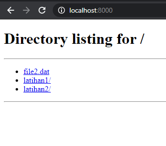
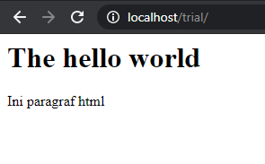

# Linux sebagai Sistem Operasi Server

Linux merupakan salah satu sistem operasi yang paling banyak digunakan untuk server, karena kemampuan enterprise dan biaya yang murah (bahkan gratis). Atas alasan itulah, Linux banyak dijumpai pada berbagai server, baik dalam skala besar maupun kecil.  Pada bagian ini akan dilakukan pengaturan Linux untuk sebagai server dengan menggunakan beberapa perangkat webserver dan application server. 


## Perangkat Lunak untuk Web Server dan Application Server
Sebuah aplikasi **webserver** berguna untuk mempublikasi file lokal agar dapat diakses melalui jaringan. Sebagai contoh, halaman HTML yang dibuat di komputer belum akan dapat diakses secara luas apabila tidak dipasang pada aplikasi webserver yang dapat mempublikasi data ini. Beberapa contoh perangkat Webserver adalah sebagai berikut:
* Apache HTTP Server
* Nginx
* LightHTTPd
* Microsoft IIS
* NodeJS
* Flask
  
Apache adalah salah satu webserver berbasis PHP yang paling sering digunakan. Dengan Apache, maka berkas yang tersimpan pada komputer akan dapat dionlinekan dengan pengaturan tertentu. Pengaturan yang dimaksud meliputi pengaturan keamanan, *virtual host*, *proxy*, dan lain sebagainya.

**Application Server** merupakan sebuah kelompok *framework* perangkat lunak yang memungkinkan sebuah *web application* untuk disajikan melalui internet. Contoh application server adalah *Java Servlet Container*, yaitu perangkat yang berfungsi untuk menyajikan aplikasi yang dibuat dengan bahasa Java pada internet. Beberapa Contoh Application Server adalah sebagai berikut:
* Apache Tomcat
* Eclipse Jetty 
* ASP.Net
* ZendServer
* JBoss EAP

Jika sebuah *webserver* umumnya menyajikan *static content*(seperti HTML, CSS, Javascript, gambar, video, dst) maka sebuah *application server* menyajikan *bussiness logic* yang memungkinkan aplikasi yang disajikan bersifat dinamis.

```{figure} img/2020-12-03-03-02-24.png
---
name: appserver
---
Perbandingan App Server dan Web Server
```

### Latihan: Menjalankan sebuah Web Server Sederhana

Untuk sekedar menguji kemampuan *port forwarding* dari WSL2 dan demonstrasi webserver, kita akan coba untuk membuat sebuah webserver sederhana. Python menyediakan sebuah webserver sederhana dengan perintah singkat:

```bash
python3 -m http.server  
```

maka folder tempat perintah tersebut dijalankan akan dapat diakses pada browser pada alamat `localhost:8000` (port default untuk server ini):



Apabila kita membuat sebuah file HTML pada folder tersebut, maka berkas tersebut dapat dibuka pada browser sebagai sebuah halaman web.


### Instalasi Apache HTTP Server
Server web **Apache HTTP Server **adalah perangkat paling populer saat ini untuk menyajikan konten web di internet. Apache menyumbang lebih dari setengah dari selurh situs web aktif di internet dengan berbagai fungsi dan kelebihan yang dimilikinya.
Pada latihan ini akan dilakukan instalasi dan konfigurasi Apache untuk publikasi data dalam bentuk HTML sederhana.

Lakukan langkah berikut untuk melakukan instalasi Apache pada sistem Ubuntu WSL:

1. Update basisdata aplikasi di Ubuntu
   ```bash
    sudo apt update
    ```
2. Instalasi Apache2
    ```bash
    sudo apt install apache2
    ```
3. Pengaturan firewall. Firewall berfungsi untuk 'mencegat' terjadinya  transfer data antara sistem lokal dengan jaringan internet. Pengaturan ini diperlukan agar apache diizinkan untuk mengakses port yang diperlukan untuk berkomunikasi dengan dunia luar

    ```bash
    sudo ufw allow 'Apache'
    ```

    Selanjutnya periksa status `ufw` menggunakan perintah:

    ```bash
    sudo ufw status
    ```

    Apabila keluarannya seperti berikut, artinya port berhasil dibuka:

    ```
    Output
    Status: active

    To                         Action      From
    --                         ------      ----
    OpenSSH                    ALLOW       Anywhere                  
    Apache                     ALLOW       Anywhere                  
    OpenSSH (v6)               ALLOW       Anywhere (v6)             
    Apache (v6)                ALLOW       Anywhere (v6)
    ```

    
4. Jalankan Apache setelah instalasi

    ```bash
    sudo service apache2 start
    ```
    Periksa apakah Apache sudah dijalankan oleh *Service*

    ```bash
    sudo service apache2 status
    ```

    Apabila status menunjukkan 'running', artinya webserver Apache sudah berhasil dijalankan
    

5. Buka localhost melalui browser pada Windows

   

   Apabila halaman Apache Ubuntu sudah terbuka, artinya instalasi Apache berhasil dengan baik    


### Membuat Website sederhana
Setelah webserver selesai dipasang, selanjutnya adalah menggunakan webserver ini untuk mempublikasi halaman web dalam bentuk HTML. Apache memiliki direktori default dalam publikasi webnya di folder:
```
/var/www/html
```

Dengan demikian, seluruh file yang disimpan pada folder tersebut akan dapat dibuka melalui browser pada alamat `localhost`.
Untuk menguji webserver ini, kita akan lakukan latihan sebagai berikut:

1. Masuk ke folder `/var/www/html` menggunakan perintah `cd`
2. Buat sebuah folder baru dengan nama `trial` pada direktori `/html` tersebut. 
   ```bash
   sudo mkdir trial
   ``` 
   Perintah `mkdir` pada folder tersebut memerlukan akses `sudo`, karena owner dari folder adalah `root`.
3. Pada folder tersebut, buat sebuah file dengan nama `index.html`
   ```bash
   sudo touch index.html
   ```
4. Isilah file tersebut dengan baris bahasa HTML berikut:
   ```html
   <html>
   <head></head>
   <body>
   <h1> The hello world</h1>
   <p> Ini paragraf html </p>
   </body>
   </html>   
   ```
5. Buka http://localhost/trial:
   
   File html yang dibuat pada folder berhasil dipanggil pada webserver

## Tomcat sebagai Servlet Aplikasi berbasis Java
Apache Tomcat adalah implementasi open-source dari Java Servlet, JavaServer Pages, Java Expression Language, dan teknologi Java WebSocket. Tomcat merupakan salah satu web Application yang paling banyak diadopsi di dunia saat ini. Tomcat mudah digunakan dan memiliki ekosistem add-on yang kuat. Apache Tomcat digunakan untuk publikasi berbagai aplikasi geospasial, seperti misalnya Geoserver dan Mapstore.

### Instalasi Tomcat
Untuk melakukan instalasi Tomcat, lakukan langkah berikut:
//https://linuxize.com/post/how-to-install-tomcat-9-on-ubuntu-18-04/
1. Update apk, kemudian install OpenJDK. OpenJDK diperlukan oleh Tomcat yang berbasis Java untuk dapat dijalankan pada Ubuntu
   ```bash
   sudo apt install default-jdk
   ```
2. Atas alasan keamanan, Tomcat tidak boleh dijalankan di bawah pengguna root. Kita perlu membuat pengguna dan grup sistem baru dengan direktori home /opt/tomcat yang akan menjalankan layanan Tomcat:
   ```bash
   sudo useradd -r -m -U -d /opt/tomcat -s /bin/false tomcat
   ```
3. Unduh instalasi Tomcat 9. Pada saat penulisan modul ini, Versi terbaru Tomcat adalah 9.0.40. Sesuaikan versi Tomcat yang digunakan dengan melihat versi rilis terbaru pada [halaman ini](https://tomcat.apache.org/download-90.cgi).
   Gunakan wget untuk mengunduh binary Tomcat untuk Instalasi:
   ```bash
   wget http://www-eu.apache.org/dist/tomcat/tomcat-9/v9.0.40/bin/apache-tomcat-9.0.40.tar.gz -P /tmp
   ```
4. Setelah unduhan selesai, gunakan perintah berikut untuk mengekstrak dan memindah file Tomcat pada folder `/opt/tomcat`:
   ```bash
   sudo tar xf /tmp/apache-tomcat-9*.tar.gz -C /opt/tomcat
   ```
5. Untuk keperluan praktis, lebih baik apabila dibuat sebuah Symbolic Link untuk mengacu pada binary yang dimaksud:
   ```bash
   sudo ln -s /opt/tomcat/apache-tomcat-9.0.40 /opt/tomcat/latest
   ```
6. Agar folder tomcat dimiliki oleh pengguna `tomcat` yang telah dibuat sebelumnya, gunakan perintah berikut:
   ```bash
   sudo chown -RH tomcat: /opt/tomcat/latest
   ```
   Demikian pula, rubah pengaturan akses pada script yang ada di dalamnya agar dapat dieksekusi:
   ```bash
   sudo sh -c 'chmod +x /opt/tomcat/latest/bin/*.sh'
   ```
7. Untuk memudahkan manajemen, Tomcat perlu dijalankan sebagai service:
   ```bash
   sudo nano /etc/systemd/system/tomcat.service
   ```
   masukkan baris berikut pada file yang dibuka:
   ```
   [Unit]
   Description=Tomcat 9 servlet container
   After=network.target

   [Service]
   Type=forking

   User=tomcat
   Group=tomcat

   Environment="JAVA_HOME=/usr/lib/jvm/default-java"
   Environment="JAVA_OPTS=-Djava.security.egd=file:///dev/urandom -Djava.awt.headless=true"

   Environment="CATALINA_BASE=/opt/tomcat/latest"
   Environment="CATALINA_HOME=/opt/tomcat/latest"
   Environment="CATALINA_PID=/opt/tomcat/latest/temp/tomcat.pid"
   Environment="CATALINA_OPTS=-Xms512M -Xmx1024M -server -XX:+UseParallelGC"

   ExecStart=/opt/tomcat/latest/bin/startup.sh
   ExecStop=/opt/tomcat/latest/bin/shutdown.sh

   [Install]
   WantedBy=multi-user.target
   ```

8. Lakukan aktivasi untuk Tomcat yang sudah diinstall:
   ```bash
   sudo systemctl daemon-reload
   sudo systemctl start tomcat
   sudo systemctl status tomcat
   ```
   Aktifkan tomcat pada saat mesin dimulai:
   ```bash
   sudo systemctl enable tomcat
   ```
9.  Izinkan Firewall untuk Tomcat
    Sama seperti pada Apache, firewall perlu dibuka untuk mengizinkan Tomcat dapat diakses:
    ```bash
    sudo ufw allow 8080/tcp
    ```

```{admonition} Catatan
Saat panduan ini ditulis, [WSL2 belum memiliki support untuk `systemd`](https://github.com/systemd/systemd/issues/8036), sehingga perintah `sudo systemctl daemon-reload` dan seterusnya di atas akan menghasilkan error.  

Untuk saat ini, berikut adalah cara yang dapat digunakan sebagai *workaround*. Metode ini diambil dari [repository github berikut](https://github.com/DamionGans/ubuntu-wsl2-systemd-script):

1. Install Git. Git akan digunakan untuk melakukan clone pada repository yang dimaksud:

    ```bash
    sudo apt install git
    ```

2. Lakukan clone pada repository di atas. Sebelum menjalankan perintah ini, pastikan pengguna aktif memiliki izin akses pada folder di dalamnya:
    ```bash
    git clone https://github.com/DamionGans/ubuntu-wsl2-systemd-script.git
    ```

3. Masuk ke dalam folder hasil clone, kemudian lakukan eksekusi pada script di dalamnya:

    ```bash
    cd ubuntu-wsl2-systemd-script/
    bash ubuntu-wsl2-systemd-script.sh
    ```
4. Tunggu sampai script selesai di eksekusi, kemudian lakukan restart pada konsol WSL (tutup jendela konsol, kemudian buka kembali)
5. Untuk menguji apakah workaround sudah berjalan, ketikkan perintah: 
    ```bash
    systemctl
    ```
apabila tidak muncul error, maka perbaikan sistem berhasil dilakukan, dan `systemctl` sudah bisa digunakan
```