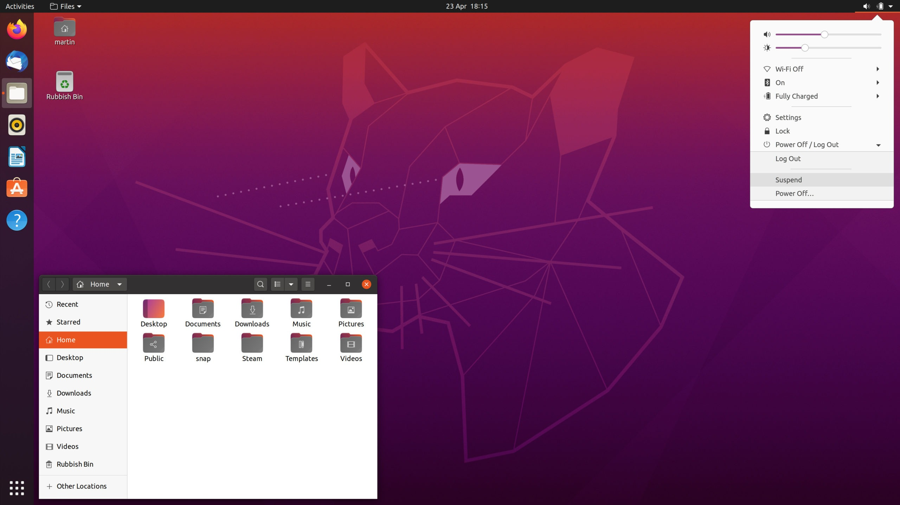
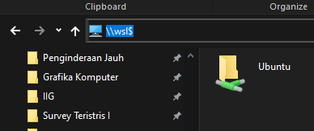
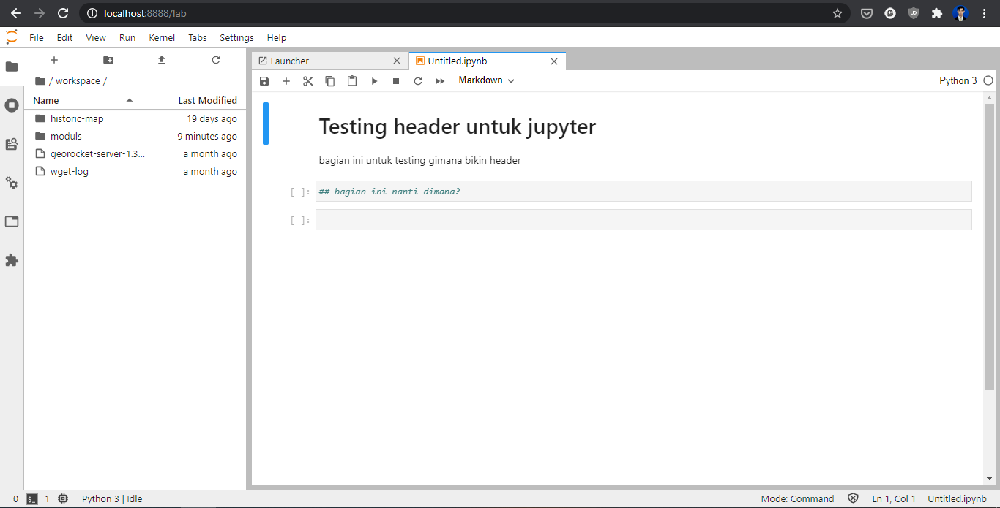
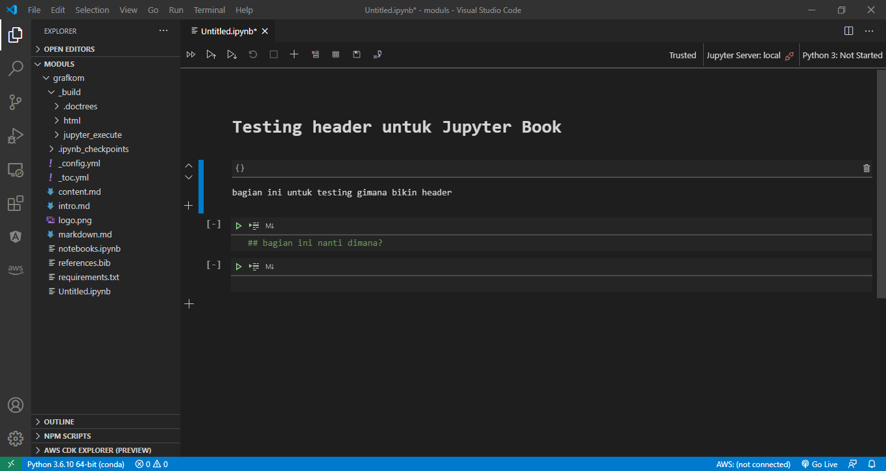

# Pengantar Linux dan Server

Bagian ini akan mengulas mengenai sejarah perkembangan Linux dan bagaimana Linux menjadi salah satu sistem operasi yang paling banyak digunakan dan paling pesat perkembangannya di dunia: **Lisensi yang bebas dan terbuka**.


## Sejarah dan Perkembangan Sistem Operasi Linux

Pada tanggal 25 Agustus 1991, [Linus Benedict Torvalds](https://github.com/torvalds) yang saat itu adalah seorang mahasiswa di University of Helsinky menulis sebuah email yang kemudian menjadi *ikon* di dunia pengembangan perangkat lunak:

> Hello everybody out there using minix -

Email sederhana ini, dengan sedikit penjelasan mengenai sistem operasi baru yang sedang ia kembangkan, kemudian menjadi awal dari adopsi besar-besaran Linux sampai menjadi sistem operasi yang sangat populer saat ini. 

```{figure} img/2020-12-01-22-47-51.png
---
height: 500px
name: linus-email
---
Email bersejarah Linus pada forum *com.os.minix*
```

Meskipun diakhiri dengan nada pesimis, Kernel Linux yang dikembangkannya menjadi salah satu *milestone* dalam sejarah komputer. Dari kernel sederhana yang menurutnya 'hanya dapat digunakan pada mesin AT-386', Linux kemudian berkembang menjadi sistem operasi yang dapat digunakan pada berbagai platform: super komputer, server, *embedded device*, dan berbagai platform lain. 

```{figure} img/2020-12-01-23-05-51.png
---
name: sejarah-linux
---
Sejarah perkembangan Linux
```

Lisensi yang terbuka ([GNU General Public License](https://www.gnu.org/licenses/gpl-3.0.en.html) yang dikembangkan oleh [Richard Stallman](https://stallman.org/)) memungkinkan Linux untuk dikembangkan secara bebas: tiap orang dapat membuat versi Linux mereka sendiri, membuat *copy*, melakukan modifikasi pada kode sumber, serta membagikan modifikasi tersebut dengan satu syarat, yaitu setiap perubahan tersebut dibuat dalam lisensi publik yang terbuka. Penggunaan lisensi ini penting dalam perkembangan Linux kemudian, sehingga bermunculan berbagai macam distribusi Linux yang menyesuaikan berbagai platform dan kebutuhan penggunanya.

## Distribusi Linux

*Linux Distribution* (disingkat *Distro*) merupakan sistem operasi yang menggunakan Kernel Linux sebagai basisnya, dengan berbagai komponen lain yang berbeda-beda, seperti *Desktop Environment, package management system,* berbagai pustaka tambahan, dan seterusnya. 

Meskipun menggunakan kernel Linux yang sama, dengan sifatnya yang bebas dan terbuka, berbagai distro ini kemudian memiliki komponen yang beragam sehingga muncul berbagai variasi [distro Linux yang tersedia saat ini](https://upload.wikimedia.org/wikipedia/commons/1/1b/Linux_Distribution_Timeline.svg). Saat dokumen ini ditulis, tidak kurang terdapat 600 distro Linux yang berbeda, dengan 500 diantaranya masih dalam tahap *development* aktif. 


```{figure} img/2020-12-01-23-31-58.png
---
name: distro-linux
---
Timeline Distribusi Linux. Klik [di sini](https://upload.wikimedia.org/wikipedia/commons/1/1b/Linux_Distribution_Timeline.svg) untuk melihat versi interaktifnya
```

Beberapa distro Linux yang populer antara lain [^footnote1]:

[^footnote1]: https://www.techradar.com/best/best-linux-distros

### Ubuntu

[Ubuntu](https://ubuntu.com/) merupakan salah satu sistem operasi Linux yang paling populer saat ini. Ubuntu dilengkapi dengan package management (*Advanced Package Tool* atau *apt*) dan *destop environment* berbasis GNOME yang mendukung kemudahan penggunaannya untuk pemula. Ubuntu didukung dengan stabilitas dan keamanan yang mumpuni dengan versi LTS (*Long Term Support*) yang dirilis secara berkala oleh Canonical sebagai developer sistem operasi ini. Atas alasan itulah Ubuntu juga menjadi salah satu sistem operasi yang banyak dijumpai pada server. Ini juga didukung oleh adanya *community support* yang besar dan aktif, serta dukungan berbagai perangkat lunak pihak ketiga pada sistemnya.





Saat ini, versi Long Term Support untuk Ubuntu adalah 20.04 (Focal Fossa). Selain versi ini, versi LTS sebelumnya adalah 18.04 (Bionic Beaver) dan 16.04 (Xenial Xerus). Untuk penggunaan pada modul ini, akan digunakan Ubuntu versi LTS 18.04, untuk mengantisipasi adanya beberapa package yang belum didukung pada versi LTS terbaru. Pada prakteknya, penggunaan versi LTS yang lebih baru akan lebih baik, karena adanya dukungan keamanan dan *patch* yang diberikan pada tiap versi terbarunya.

### CentOS

[CentOS](https://www.centos.org/) merupakan pengembangan dari RedHat Linux yang banyak digunakan untuk komputer pada server maupun komputasi awan. Sebagai sebuah sistem operasi desktop, CentOS juga dilengkapi dengan antarmuka berbasis GNOME, sama seperti Ubuntu. CentOS dikenal karena menyediakan fungsi Enterprise sebagai sebuah sistem operasi pada server tanpa perlu mengeluarkan biaya sepeser pun.


### Linuxmint

Bagi pengguna yang baru saja ingin migrasi dari Windows dan mencoba antarmuka Linux Desktop, [Linuxmint](https://www.centos.org/) merupakan pilihan yang sesuai. Desain antarmukanya dibuat sedemikian rupa untuk memudahkan pengguna pemula yang ingin mencoba Linux. 


### ArchLinux

Untuk pengguna yang menginginkan kebebasan kustomisasi tanpa mengorbankan antarmuka berbasis desktop, [ArchLinux](https://www.archlinux.org/) dapat menjadi pilihan yang sesuai. ArchLinux memiliki konsep ringan (*lightweight*), dengan komponen desktop environment yang kaya pilihan: Cinnamon, Enlightenment, GNOME, KDE, LXDE, MATE, Xfce. 


### Elemetary OS

Selain LinuxMint, [ElementaryOS](https://elementary.io/) dikenal sebagai sistem operasi dengan tampilan yang paling memukau. Sistem Operasi ini didesain dengan tampilan yang, bagi pengguna Mac maupun Windows, akan terasa familiar. ElementaryOS dikembangkan dari sistem operasi Ubuntu LTS, dan membanggakan kebijakan penjagaan privasi yang kuat untuk penggunanya. 


### Kali Linux

Barangkali [Kali Linux](https://www.kali.org/) merupakan sistem operasi yang paling dikenal di kalangan Hacker. Kali Linux merupakan sistem operasi Linux yang dirancang khusus untuk keperluan *penetration testing* atau pengujian keamanan suatu sistem atau perangkat lunak. Instalasi standar Kali Linux dilengkapi dengan [berbagai perangkat](https://tools.kali.org/) yang dapat digunakan untuk melakukan *pentesting*, seperti `aircrack-ng` dan `Wireshark`. Kali Linux bahkan juga dilengkapi dengan PowerShell bagi pengguna yang menginginkan lingkungan scripting tersebut pada Linux.


Selain berbagai distro yang disebutkan di atas, terdapat ratusan distro lain yang digunakan untuk berbagai keperluan. Tiap distro memiliki keunggulan masing-masing, sehingga daftar ini terlalu pendek untuk sebuah ulasan lengkap. [Situs ini](https://distrowatch.com/) menyediakan perbandingan untuk tiap distro yang terdaftar berikut ulasan singkat mengenai masing-masing distro.

## Windows Subsystem for Linux

Dengan perkembangan pesat Linux pada berbagai platform dan dukungan komunitas yang sangat besar, Linux menjadi sistem operasi yang banyak digunakan oleh pengembang aplikasi, khususnya pada penggunaan server. Linux banyak digunakan karena selain mudah, keamanan dan stabilitas sistem yang diberikan juga menjadi poin penting dalam penggunaannya untuk keperluan server. Di sisi lain, Windows sebagai sistem operasi yang paling populer saat ini juga banyak digunakan untuk keperluan sehari-hari. Untuk itu, pengembangan perangkat lunak seringkali melibatkan kedua sistem operasi ini sekaligus (juga MacOS, bagi pengguna setianya). Pada bagian ini akan dibahas mengenai WSL versi 2 sebagai jembatan untuk Windows dan Linux yang akan sangat membantu pengembang dalam menggunakan Linux pada Sistem Operasi Windows.

### Tentang Windows Subsystem for Linux (WSL)

Pada tahun 2017, Microsoft sebagai pesaing terbesar Linux membuat pengumuman yang mengejutkan: Windows 10 sebagai sistem operasi utama Windows pada saat ini akan memiliki dukungan untuk menjalankan Linux Kernel secara *native*. Sebelumnya, bagi *developer* yang ingin menggunakan Windows dan Linux secara bersamaan harus menggunakan perangkat virtualisasi (misalnya Vagrant) atau melakukan instalasi dual-boot agar kedua sistem dapat berjalan. Penggunaan WSL memungkinkan Linux untuk dapat dijalankan dengan ringan pada sistem operasi Windows.


```{figure} img/2020-12-02-00-35-17.png
---
name: wsl
---
WSL memungkinkan Linux dijalankan pada Windows
```

WSL2 (Windows Subsystem for Linux 2) merupakan integrasi mesin berbasis Linux pada Windows yang memungkinkan mesin Linux untuk dapat dijalankan pada Windows dengan performa maksimal. Indeks angka "2" menunjukkan bahwa virtualisasi ini adalah pengembangan lebih jauh dari mesin WSL yang pertama kali diusulkan oleh Microsoft pada tahun 2017. Perbedaan mencolok terlihat karena pada WSL2, mesin virtual yang dipasang menggunakan kernel linux yang sebenarnya. Artinya, performa yang dapat diperoleh dari mesin virtual ini juga sebaik mesin Linux dengan kekuatan penuh. Selain itu, dengan menggunakan [Distro yang didukung oleh WSL2](https://ubuntu.com/wsl), akses Windows pada mesin (dan sebaliknya) dapat dilakukan secara hampir *seamless*.


```{figure} img/image-20201129191425719.png
---
name: wsl2
---
Ubuntu yang khusus dirancang untuk WSL
```

### Latihan: Instalasi WSL2 Pada Windows 10


Untuk instalasi WSL2 ini, berikut adalah persyaratan yang harus dipenuhi:

- Windows 10 dengan versi update terbaru: Windows 10 May 2020 (2004), Windows 10 May 2019 (1903), or Windows 10 November 2019 (1909). Windows dengan versi update lama (1903 atau 1909) tetap dapat menginstall WSL2 dengan terlebih dahulu melakukan instalasi Windows Update [berikut ini](https://support.microsoft.com/en-us/help/4566116/windows-10-update-kb4566116)
- Komputer atau laptop yang memiliki dukungan **Hyper-V Virtualization**. Periksa [link berikut](https://www.zdnet.com/article/windows-10-tip-find-out-if-your-pc-can-run-hyper-v/) untuk mengetahui apakah Komputer atau laptop Anda memiliki dukungan Hyper-V.

Untuk melihat versi build Windows yang Anda gunakan, lakukan langkah berikut:

- Buka Windows Run (Win+R)

- Ketikkan `'winver'`

- Pada jendela yang muncul, akan terlihat versi build Windows yang sedang berjalan

  
  
  
  
  Apabila versi build Windows Anda di bawah `18362`, maka terlebih dulu lakukan update Windows menggunakan [Update Assistant](https://www.microsoft.com/software-download/windows10).

  Jika Hyper-V belum diaktifkan pada firmware, maka opsi ini perlu diaktifkan terlebih dulu pada BIOS. [Panduan ini](https://techcommunity.microsoft.com/t5/itops-talk-blog/step-by-step-enabling-hyper-v-for-use-on-windows-10/ba-p/267945) menyediakan langkah yang diperlukan untuk mengaktifkan Hyper-V pada BIOS dan pada Windows 10.


> **Catatan:**
>
> Panduan ini dibuat dengan mengikuti panduan resmi di:
>
>  https://docs.microsoft.com/en-us/windows/wsl/install-win10
>
> Periksa tautan tersebut untuk melihat perubahan terbaru terkait dengan instalasi WSL


Berikut adalah petunjuk untuk melakukan instalasi WSL2 pada Sistem Operasi Windows 10:

1. *Mengaktifkan WSL melalui PowerShell*

   Buka `Windows PowerShell` sebagai Administrator.   

   

   Ketikkan perintah berikut pada command prompt yang tersedia:

   ```bash
   dism.exe /online /enable-feature /featurename:Microsoft-Windows-Subsystem-Linux /all /norestart
   ```

   Akan muncul pemberitahuan apabila proses telah berhasil:

   

   &nbsp;  

2. *Update ke WSL versi 2* 

   Pastikan versi build Windows yang digunakan sesuai untuk persyaratan WSL2 seperti di atas. Periksa [link berikut](https://docs.microsoft.com/en-us/windows/wsl/install-win10#step-2---update-to-wsl-2) untuk melihat lebih detil mengenai bagian ini.

   &nbsp;  

3. *Aktifkan Virtual Machine Platform*

   Pada jendela PowerShell yang sama (sebagai Administrator), ketikkan perintah berikut:

   ```bash
   dism.exe /online /enable-feature /featurename:VirtualMachinePlatform /all /norestart
   ```

   Setelah perintah selesai dijalankan, lakukan **restart pada Windows**. Ini akan mengupdate WSL pada system menjadi versi ke-2

   &nbsp;  

   ```{Caution}
   Restart Windows penting dalam hal ini agar sistem WSL terupdate pada versi terbaru.
   ```
   
   &nbsp;  


4. *Unduh Linux kernel untuk WSL2*

   Terlebih dahulu unduh dan install Linux Kernel untuk WSL2 dari [Link Berikut](https://wslstorestorage.blob.core.windows.net/wslblob/wsl_update_x64.msi).

   Setelah instalasi berhasil, masukkan perintah berikut ke dalam PowerShell yang sama seperti sebelumnya:

   ```bash
   wsl --set-default-version 2
   ```

   Ini akan membuat versi WSL yang telah terinstall menggunakan versi kedua.

   &nbsp;  

5. *Melakukan Instalasi Distro Linux*

   Pada [Microsoft Store](https://aka.ms/wslstore) telah tersedia beberapa distro Linux yang dapat digunakan pada WSL. Buka Microsoft Store, kemudian lakukan instalasi untuk distro yang dipilih. Untuk latihan ini, gunakan `Ubuntu`, khususnya versi [Ubuntu 18.04](https://www.microsoft.com/store/apps/9N9TNGVNDL3Q).

   

   &nbsp;  
   Klik `Get` untuk melakukan instalasi Ubuntu pada WSL2

   &nbsp;  
   

   &nbsp;  


6. *Memulai WSL*

   Setelah instalasi selesai, Ubuntu dapat langsung digunakan pada Windows. Untuk memulai WSL, buka icon menu bergambar logo Ubuntu pada Start Menu. 

   Pada saat pertama kali dibuka, mesin akan meminta **username** dan **password**. Catat username dan password yang dimasukkan karena ini akan menjadi akun *sudoer*  pada mesin Linux yang dibuat.

   

   Selanjutnya, Ubuntu siap digunakan

   

   &nbsp;  

7. *Integrasi WSL dan Windows*

   Telah disampaikan sebelumnya bahwa integrasi Linux dan Windows menggunakan WSL2 bersifat hampir seamless. Artinya, kedua sistem dapat saling berkomunikasi tanpa memerlukan media perantara yang rumit.

   Untuk mengakses file WSL dari windows, buka Explorer, kemudian ketikkan pada bagian directory list: `\\wsl$`.

   

   Maka Windows akan membuka drive pada Linux sebagaimana sebuah folder biasa pada Explorer.

   

   Berkas yang disimpan pada 'folder' ini akan langsung terintegrasi dengan Linux tanpa perlu melakukan *rebooting*.

   Demikian pula, pada saat Ubuntu memanggil port tertentu, maka WSL akan secara otomatis melakukan *port forwarding*, sehingga port tersebut dapat dibuka pada Windows tanpa perlu melakukan langkah tambahan apapun.

   Sebagai contoh, berikut adalah pemanggilan Jupyter Lab dari konsol Ubuntu pada WSL2:

   

   Dan berikut adalah tampilan Jupyter Lab apabila dibuka pada browser di Windows:

   

   &nbsp;  

8. *WSL2 untuk keperluan pembangunan aplikasi (development)*

   Untuk keperluan pembangunan aplikasi, WSL2 memungkinkan koneksi pada beberapa Code Editor. Sebagai contoh, VSCode memiliki dukungan untuk melakukan *editing* kode pada WSL2 melalui plugin. Klik [Link berikut](https://code.visualstudio.com/docs/remote/wsl) untuk detilnya.

   

   Berikut adalah contoh pemanggilan VSCode dari mesin Ubuntu:

   

   <br>

   dan berikut adalah tampilan dari VSCode yang langsung terbuka dan terkoneksi dengan WSL2 tersebut:

   <br>

   


&nbsp;  

Karena pengaturan *resource* untuk komputasi (memory, space harddisk) dilakukan [secara bersama-sama](https://www.digitalocean.com/community/posts/trying-the-new-wsl-2-its-fast-windows-subsystem-for-linux) oleh Windows dan WSL2 melalui Linux Kernel, maka penggunaan WSL tidak akan membebani sistem Windows. Dengan demikian, penggunaan Linux pada WSL2 ini adalah metode yang lebih disarankan daripada menggunakan Virtual Machine seperti VirtualBox atau VMWare yang dapat membebani kinerja sistem.

Hasil dari latihan di atas adalah WSL2 dengan Ubuntu sebagai sistem operasi yang dapat digunakan pada Windows. Selain diinstall sebagai WSL yang dapat diakses pada sistem lokal, terdapat beberapa opsi lain yang daat dilakukan untuk menggunakan Linux. [Link berikut](https://www.danylaksono.com/docs/linuxvm/) memberikan panduan ringkas mengenai bagaimana melakukan instalasi Linux baik pada Cloud maupun lokal.