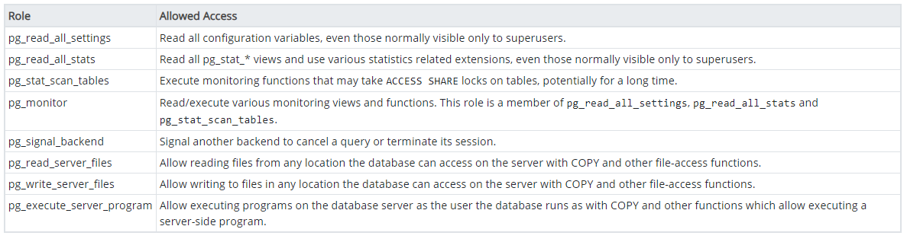
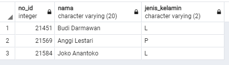
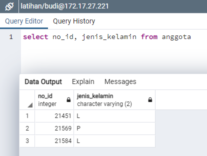
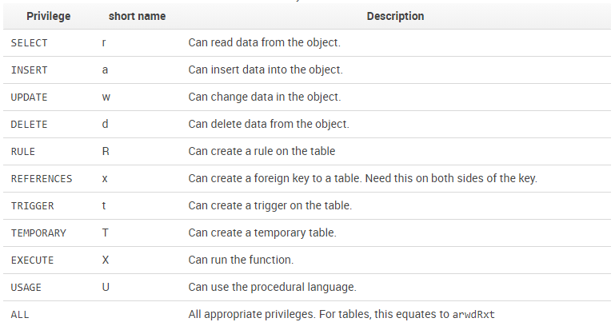

# Administrasi Pengguna pada Basisdata
Pada basisdata enterprise, concurrent use atau pemakaian bersama menjadi kebutuhan utama pada sistem yang berjalan. Sama seperti pada sistem operasi Linux yang sudah dibahas sebelumnya, terdapat pengaturan untuk memberikan izin pada basisdata yang memungkinkan pengguna berbeda mempunyai izin akses yang berbeda. 


## Roles, Group dan Priviledges 
Izin pada pengguna di PostgreSQL mirip dengan pemberian izin pada Linux: pembagian peran (role) dapat diberikan pada user maupun grup, dengan tiap role memiliki hak akses (priviledges) yang berbeda


```{figure} img/2020-12-03-09-08-19.png
---
height: 400px
name: pgroles
---
Roles pada PostgreSQL dapat diberikan pada `grup` maupun pada `user`
```

Berikut adalah beberapa peran yang dapat diberikan pada pengguna atau grup:

* **SUPERUSER** - SUPERUSER database perlu mendapat perhatian khusus. Intinya, peran dengan atribut ini dapat membuat SUPERUSER lain. Faktanya, atribut ini diperlukan untuk membuat peran SUPERUSER lainnya. Karena peran dengan atribut ini mengabaikan semua pemeriksaan izin, berikan hak istimewa ini dengan bijaksana.
* **CREATEDB** - Memungkinkan peran untuk membuat database.
* **CREATEROLE** - Dengan atribut ini, peran dapat mengeluarkan perintah CREATE ROLE, yaitu membuat peran lain.
* **LOGIN** - Memungkinkan kemampuan untuk login. Nama peran dengan atribut ini dapat digunakan dalam perintah koneksi klien. 

Pada PostgreSQL, pengaturan ini dapat dijumpai pada menu Create Roles, seperti berikut:

```{figure} img/2020-12-08-08-09-45.png
---
height: 400px
name: pengaturanroles
---
Menu pengaturan Roles pada PostgreSQL
```


## Pengaturan hak akses pada PostgreSQL
Dengan PostgreSQL, Anda dapat membuat pengguna dan peran dengan izin akses secara *granular*. Pengguna atau peran baru harus secara selektif diberikan izin yang diperlukan untuk setiap objek database. Ini memberi banyak kekuatan kepada pengguna akhir, tetapi pada saat yang sama, itu membuat proses pembuatan pengguna dan peran dengan izin yang benar berpotensi rumit.

PostgreSQL memungkinkan Anda memberikan izin langsung ke pengguna database. Namun, sebagai praktik yang baik, Anda disarankan untuk membuat **banyak peran** dengan kumpulan izin tertentu berdasarkan aplikasi dan persyaratan akses. Kemudian tetapkan peran yang sesuai untuk setiap pengguna. Peran harus digunakan untuk menerapkan model dengan hak istimewa terendah untuk mengakses objek database. Pengguna master pada PostgreSQL harus digunakan hanya untuk tugas administrasi database seperti membuat pengguna, peran, dan database lain. Pengguna master tidak boleh digunakan oleh aplikasi. Berikut adalah contoh pembagian peran dan pemberian izin:

```{figure} img/2020-12-03-09-09-34.png
---
height: 400px
name: pembagianperan
---
Contoh pengaturan untuk pembagian peran pada PostgreSQL
```


### Membuat pengguna dan grup baru 
Pengguna pada PostgreSQL dibuat melalui query berikut:

```sql
 CREATE USER username [ [ WITH ] 
   SYSID uid 
   | [ ENCRYPTED | UNENCRYPTED ] PASSWORD 'password'
   | CREATEDB | NOCREATEDB
   | CREATEUSER | NOCREATEUSER
   | IN GROUP groupname [, ...]
   | VALID UNTIL 'abstime' ]
```

Sebagai contoh, perintah berikut akan membuat **pengguna baru** dengan nama 'user1' dan password 'password1':

```sql
CREATE USER user1 WITH PASSWORD 'password1';
```

Adapun **grup** merupakan salah satu cara untuk mengelompokkan pengguna tertentu. Grup dapat dibuat dengan perintah berikut:

```sql
CREATE GROUP sales WITH USER user1;
```

### Menerapkan peran baru
**[Role](https://www.postgresql.org/docs/13/user-manag.html)** merupakan cara PostgreSQL mengatur batasan akses oleh pengguna. Tiap Role dapat memiliki pengaturan *Priviledges* yang berbeda untuk membatasi hak akses yang dapat dilakukan oleh tiap-tiap pengguna. Berikut adalah bagaimana peran dibuat dengan menggunakan bahasa SQL:

```sql
CREATE ROLE user_viewer WITH LOGIN PASSWORD 'pass2';
```
PostgreSQL 13 telah dilengkapi dengan beberapa roles default yang dapat digunakan, yaitu sebagai berikut:



Peran *default* tersebut dapat diberikan pada pengguna tertentu melalui perintah:

```sql
GRANT pg_read_server_files TO user1;
```

Demikian pula, perintah tersebut dapat dilakukan untuk grup, sehingga hak akses menjadi milik semua pengguna pada grup tersebut.


### Latihan: Menggunakan Pengaturan Roles untuk membatasi akses
Untuk latihan ini, kita akan gunakan tabel `anggota` pada latihan sebelumnya. Kita akan membuat skema pengaturan pengguna melalui grup, user dan roles untuk membatasi akses pada tabel `anggota`. Kita akan menggunakan Query pada PostgreSQL untuk keperluan ini (bukan antarmuka PostgreSQL - menggunakan Query relatif lebih sederhana).



1. Langkah pertama adalah membuat *role* baru untuk pengguna kita nantinya. Role ini diatur agar hanya dapat membaca tabel tertentu:
   
   ```sql
   CREATE ROLE readonly_tabel;
   GRANT CONNECT ON DATABASE latihan TO readonly_tabel;
   GRANT USAGE ON SCHEMA public TO readonly_tabel;
   ```

   Tiga perintah di atas berfungsi untuk membuat role baru, memberikan hak akses atas basisdata `latihan` kepada role tersebut, serta memberi akses pada skema `public` yang terdapat di dalam basisdata latihan. Hasilnya adalah sebagai berikut:

   
   
2. Kita akan membatasi akses ke tabel `anggota` agar role `readonly_tabel` hanya dapat membaca kolom id dan jenis kelamin saja.
   
   ```sql
   GRANT SELECT (no_id, jenis_kelamin) ON TABLE public.anggota TO readonly_tabel;
   ```

   pada perintah di atas, user budi hanya dapat mengakses kolom no_id dan jenis_kelamin

3. Membuat pengguna baru untuk akses dengan role ini
   
   ```sql
   CREATE USER budi WITH PASSWORD 'secret';
   GRANT readonly_tabel TO budi;
   ```
   
4. Lakukan koneksi ke PostgreSQL dengan user baru ini. Gunakan antarmuka PostgreSQL untuk Logout, kemudian login kembali dengan user `budi` dan password `secret`.
   
5. Buat query untuk memilih seluruh isi tabel anggota:
   ```sql
   SELECT * FROM TABLE anggota
   ```

   hasilnya adalah error karena user `budi` tidak diizinkan untuk mengakses seluruh isi tabel:

   

6. Apabila kita hanya memilih kolom `no_id` dan `jenis_kelamin`, maka hasilnya:
   
   


Latihan di atas menunjukkan bagaimana pengaturan role pada pengguna dapat digunakan untuk membatasi akses pada basisdata, tabel, kolom maupun view. Dengan demikian kita dapat mengatur hak akses yang cukup kompleks untuk berbagai kebutuhan. 


## Mengatur koneksi multi-pengguna
Apabila terdapat beberapa pengguna, maka hak akses (priviledges) untuk tiap pengguna ini dapat ditentukan dengan mengaturnya melalui roles, group maupun langsung ke pengguna itu sendiri.

### Latihan: Pengaturan Priviledges
PostgreSQL memiliki dua tingkat otorisasi, satu di tingkat database, yang disebut [otentikasi berbasis **host**](https://www.davidpashley.com/articles/postgresql-user-administration/), dan satu lagi di tingkat yang lebih detil pada tabel, *view*, dan *sequence*.
Adapun daftar permission yang dapat diberikan pada pengguna adalah:




Berikut adalah contoh pemberian izin kepada pengguna untuk mengakses basisdata tertentu:

```sql
GRANT { { SELECT | INSERT | UPDATE | DELETE | RULE | REFERENCES | TRIGGER }
    [,...] | ALL [ PRIVILEGES ] }
    ON [ TABLE ] tablename [, ...]
    TO { username | GROUP groupname | PUBLIC } [, ...] [ WITH GRANT OPTION ]
```
Seagai contoh, untuk memberikan izin pada '**bob**' untuk memodifikasi tabel **supplier**:

```sql
GRANT INSERT, UPDATE, DELETE ON TABLE suppliers TO bob;
```

### Latihan: Terhubung dengan server basisdata
Sebagai latihan, gunakan koneksi berikut untuk terhubung pada basisdata PostGIS yang tersimpan di Amazon Lightsail:

host: 54.254.9.31
port: 5432

user 1:
 - username: view_only
 - password: 'viewer'
 - role: pg_read_server_file

user 2:
 - username: editor_data
 - password: 'editor'
 - role: pg_write_server_file

user 3 (SUPERUSER):
 - username: postgres
 - password: 'postgres'
 

