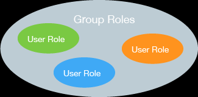

# Administrasi Pengguna pada Basisdata
Pada basisdata enterprise, concurrent use atau pemakaian bersama menjadi kebutuhan utama pada sistem yang berjalan. Sama seperti pada sistem operasi Linux yang sudah dibahas sebelumnya, terdapat pengaturan untuk memberikan izin pada basisdata yang memungkinkan pengguna berbeda mempunyai izin akses yang berbeda. 


## Roles, Group dan Priviledges 
Izin pada pengguna di PostgreSQL mirip dengan pemberian izin pada Linux: pembagian peran (role) dapat diberikan pada 



Berikut adalah beberapa peran yang dapat diberikan pada pengguna atau grup:

* **SUPERUSER** - SUPERUSER database perlu mendapat perhatian khusus. Intinya, peran dengan atribut ini dapat membuat SUPERUSER lain. Faktanya, atribut ini diperlukan untuk membuat peran SUPERUSER lainnya. Karena peran dengan atribut ini mengabaikan semua pemeriksaan izin, berikan hak istimewa ini dengan bijaksana.
* **CREATEDB** - Memungkinkan peran untuk membuat database.
* **CREATEROLE** - Dengan atribut ini, peran dapat mengeluarkan perintah CREATE ROLE, yaitu membuat peran lain.
* **LOGIN** - Memungkinkan kemampuan untuk login. Nama peran dengan atribut ini dapat digunakan dalam perintah koneksi klien. 


## Pengaturan hak akses pada PostgreSQL
Dengan PostgreSQL, Anda dapat membuat pengguna dan peran dengan izin akses secara *granular*. Pengguna atau peran baru harus secara selektif diberikan izin yang diperlukan untuk setiap objek database. Ini memberi banyak kekuatan kepada pengguna akhir, tetapi pada saat yang sama, itu membuat proses pembuatan pengguna dan peran dengan izin yang benar berpotensi rumit.

PostgreSQL memungkinkan Anda memberikan izin langsung ke pengguna database. Namun, sebagai praktik yang baik, Anda disarankan untuk membuat **banyak peran** dengan kumpulan izin tertentu berdasarkan aplikasi dan persyaratan akses. Kemudian tetapkan peran yang sesuai untuk setiap pengguna. Peran harus digunakan untuk menerapkan model dengan hak istimewa terendah untuk mengakses objek database. Pengguna master pada PostgreSQL harus digunakan hanya untuk tugas administrasi database seperti membuat pengguna, peran, dan database lain. Pengguna master tidak boleh digunakan oleh aplikasi. Berikut adalah contoh pembagian peran dan pemberian izin:


### Latihan: Membuat pengguna dan grup baru 
Pengguna pada PostgreSQL dibuat melalui query berikut:

```sql
 CREATE USER username [ [ WITH ] 
   SYSID uid 
   | [ ENCRYPTED | UNENCRYPTED ] PASSWORD 'password'
   | CREATEDB | NOCREATEDB
   | CREATEUSER | NOCREATEUSER
   | IN GROUP groupname [, ...]
   | VALID UNTIL 'abstime' ]
```

Sebagai contoh, perintah berikut akan membuat pengguna dengan nama 'user1' dan password 'password1':

```sql
CREATE USER user1 WITH PASSWORD 'password1';
```

Adapun grup merupakan salah satu cara untuk mengelompokkan pengguna tertentu. Grup dapat dibuat dengan perintah berikut:

```sql
CREATE GROUP sales WITH USER user1;
```

### Latihan: Menerapkan peran baru
Role merupakan cara PostgreSQL mengatur pengguna. Tiap peran dapat memiliki pengaturan Priviledges yang berbeda untuk membatasi hak akses tiap pengguna. Berikut adalah bagaimana peran dibuat dengan menggunakan bahasa SQL:

```sql
CREATE ROLE user_viewer WITH LOGIN PASSWORD 'pass2';
```

## Mengatur koneksi multi-pengguna
Apabila terdapat beberapa pengguna, maka hak akses (priviledges) untuk tiap pengguna ini dapat ditentukan dengan mengaturnya melalui roles, group maupun langsung ke pengguna itu sendiri.

### Latihan: Pengaturan Priviledges
PostgreSQL memiliki dua tingkat otorisasi, satu di tingkat database, yang disebut [otentikasi berbasis **host**](https://www.davidpashley.com/articles/postgresql-user-administration/), dan satu lagi di tingkat yang lebih detil pada tabel, *view*, dan *sequence*.
Adapun daftar permission yang dapat diberikan pada pengguna adalah:


Berikut adalah contoh pemberian izin kepada pengguna untuk mengakses basisdata tertentu:

```sql
GRANT { { SELECT | INSERT | UPDATE | DELETE | RULE | REFERENCES | TRIGGER }
    [,...] | ALL [ PRIVILEGES ] }
    ON [ TABLE ] tablename [, ...]
    TO { username | GROUP groupname | PUBLIC } [, ...] [ WITH GRANT OPTION ]
```
Seagai contoh, untuk memberikan izin pada '**bob**' untuk memodifikasi tabel **supplier**:

```sql
GRANT INSERT, UPDATE, DELETE ON TABLE suppliers TO bob;
```

### Latihan: Terhubung dengan server basisdata
Sebagai latihan, gunakan koneksi berikut untuk terhubung pada basisdata PostGIS yang tersimpan di Amazon Lightsail:

host: 54.254.9.31
port: 5432

user 1:
 - username: view_only
 - password: 'viewer'
 - role: pg_read_server_file

user 2:
 - username: editor_data
 - password: 'editor'
 - role: pg_write_server_file

user 3 (SUPERUSER):
 - username: postgres
 - password: 'postgres'
 

