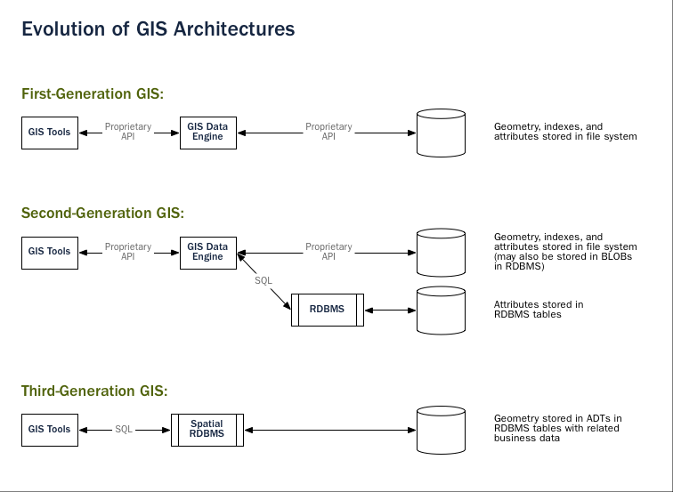

# Basisdata Spasial dengan PostGIS

## Pengantar PostGIS
https://postgis.net/workshops/postgis-intro/introduction.html

### Latihan: Memasukkan data spasial

### Latihan: Query Spasial sederhana

## Menggunakan QGIS sebagai antarmuka PostGIS

### Latihan: Query Spasial pada data vektor

### Latihan: Query Spasial pada Raster