# Basisdata Relational

Basisdata relational merupakan salah satu model basisdata pada DBMS (Database Management System). Model Relasional banyak digunakan sejak tahun 90an hingga saat ini karena berbagai kelebihannya dalam memanajemen data dalam jumlah besar. Pada bagian ini akan dibahas mengenai basisdata relasional, khususnya PostgreSQL.

## Pemodelan data pada Basisdata Relasional
Kita ambil sebuah contoh untuk kasus penanggulangan kebencanaan: anda ditugaskan oleh pimpinan anda untuk melakukan inventarisasi data yang diperoleh dari hasil pemetaan akibat bencana banjir di suatu daerah. Anda misalnya berurusan dengan data-data jumlah pengungsi dari masing-masing desa, kerusakan pada tiap desa, lokasi kantung-kantung pengungsian, kebutuhan tiap kepala, dan lain sebagainya. Apabila dinyatakan dalam bentuk tabel, data-data tersebut mungkin tampak seperti berikut:

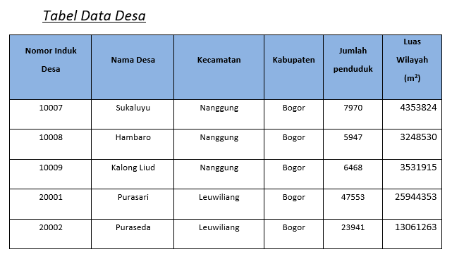

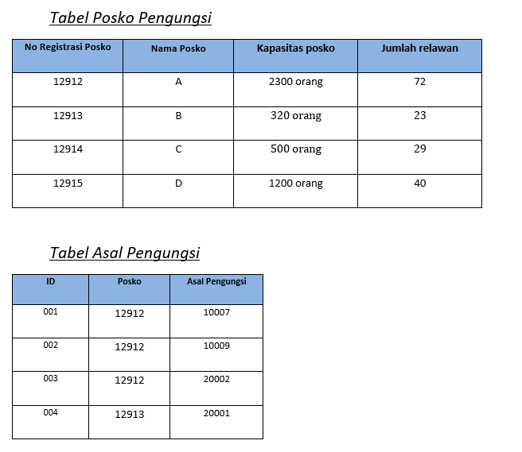

Apabila suatu ketika Anda ditanya, ‘*Dari mana saja asal pengungsi di Posko A*?’, apa jawaban yang akan anda berikan? Apa yang akan anda lakukan untuk memperoleh jawaban yang diinginkan?	
Pertama-tama, Anda mungkin akan melihat pada masing-masing tabel, kemudian mencari informasi yang sesuai pada tiap tabel tersebut. Tentunya hal ini mudah dilakukan apabila data yang disediakan cukup sedikit. Bagaimana jika data yang ada berjumlah ratusan atau bahkan mungkin ribuan data?

Di sinilah peranan **Basisdata**. Sebuah sistem basisdata menghubungkan kumpulan data menjadi sebuah sistem yang terintegrasi. Dapat dikatakan, basisdata merupakan kumpulan dari tabel-tabel yang saling terhubung. Dengan menggunakan basisdata, Anda dapat mengambil data dari suatu tabel berdasarkan data dari tabel yang lain.

Gambaran umum sebuah basisdata adalah *sekumpulan tabel yang saling terhubung*. Hubungan antar tabel ini dapat dilakukan dengan berbagai macam cara. Salah satunya adalah dengan menggunakan cara yang Anda lihat pada contoh tabel-tabel di atas.


## Pengantar Basisdata Relational
**Sistem Manajemen Basis Data Relasional** (RDBMS) adalah kumpulan program dan fungsi berbasis tabel yang menyediakan antarmuka antara pengguna dan aplikasi dan basis data, memberikan cara sistematis untuk membuat, memperbarui, menghapus, mengelola, dan mengambil data. Sebagian besar sistem manajemen database relasional menggunakan bahasa pemrograman SQL untuk mengakses database dan banyak yang mengikuti properti *ACID (Atomicity, Consistency, Isolation, Durability)* dari database:
* **Atomicity**: Jika ada pernyataan dalam transaksi yang gagal, seluruh transaksi gagal dan database dibiarkan tidak berubah.
* **Consistency**: Transaksi harus memenuhi semua protokol yang ditentukan oleh sistem - tidak ada transaksi yang diselesaikan sebagian.
* **Isolation**: Tidak ada transaksi yang memiliki akses ke transaksi lain yang belum selesai. Setiap transaksi bersifat independen.
* **Durability**: Setelah transaksi dilakukan, transaksi akan tetap dilakukan melalui penggunaan log transaksi dan cadangan.


c

Basisdata relasional menyimpan data (entitas dunia nyata) dalam bentuk tabel serta menyediakan cara yang efisien, intuitif, dan fleksibel untuk menyimpan dan mengakses informasi pada tabel tersebut secara terstruktur. Tabel pada basisdata relasional juga dikenal sebagai **relasi**, terdiri dari kolom yang berisi satu atau lebih kategori data; dan baris, juga dikenal sebagai *record*, berisi sekumpulan data yang ditentukan oleh kategori. 

Aplikasi Database Management System/DBMS (seperti PostgreSQL) mengakses data dengan menentukan **kueri**, yang menggunakan operasi untuk mengidentifikasi atribut, memilih *tuples*, dan menentukan relasi pada data. Model relasional untuk manajemen basis data dikembangkan oleh ilmuwan komputer IBM Edgar F. Codd pada tahun 1970.

### Beberapa istilah pada Basisdata Relasional
Sebagai review, berikut adalah beberapa istilah yang dikenal pada basisdata relasional:
* **Tabel**: Merupakan struktur penyimpanan dasar dari basis data objek relasional, terdiri dari satu atau lebih kolom (column) dan nol atau lebih baris (row).
* **Row (baris)**: Baris merupakan kombinasi dari nilai-nilai kolom dalam tabel; sebagai contoh, informasi tentang suatu departemen pada tabel 'Departemen'. Baris seringkali disebut dengan record atau tuple.
* **Column (kolom)**: Kolom menggambarkan jenis data pada tabel; Kolom di definisikan dengan nama kolom dan tipe data beserta panjang data tertentu.
* **Field**: Field merupakan pertemuan antara baris dan kolom. Sebuah field menggambarkan satu keterangan mengenai data. Jika pada suatu field tidak terdapat data, maka field tersebut dikatakan memiliki nilai “null” atau kosong.
* **Primary key**: Primary key atau kunci utama merupakan kolom atau kumpulan kolom yang secara unik membedakan antara baris yang satu dengan lainnya; Kolom yang merupakan primary key ini tidak boleh mengandung nilai “null”, dan nilainya harus unik (berbeda antara baris satu dengan lainnya).
* **Foreign key**: Foreign key atau kunci tamu merupakan kolom atau kumpulan kolom yang mengacu ke primary key pada tabel yang sama atau tabel lain. Foreign key ini dibuat untuk memaksakan aturan-aturan relasi pada basis data. Nilai data dari foreign key harus sesuai dengan nilai data pada kolom dari tabel yang diacunya atau bernilai “null”.
* **Relasi** merupakan interaksi antara tabel yang menunjukkan hubungan antara objek-objek yang ada di dunia nyata. Relasi menyatakan hubungan antar tabel sebagai model dari dunia nyata.  

```{figure} img/2020-12-03-06-57-27.png
---
height: 300px
name: table
---
Tabel atau relasi pada Basisdata Relational
```

### Relasi pada basisdata relasional
Jika kita pahami bahwa entitas dunia nyata dimodelkan sebagai sebuah **relasi** (atau tabel) pada basisdata relasional, maka hubungan antar entitas tersebut di dunia nyata juga dapat kita modelkan. Pada sebuah basisdata relasional, hubungan antar entitas dapat disederhanakan menjadi tiga bentuk saja: One to One, One to Many dan Many to Many. Berikut adalah model relasi pada sebuah basisdata relasional[^footnote7] tersebut:

[^footnote7]: https://aantamim.id/relasi-tabel-database/


1. **One to One (1 to 1)**
   Relasi database model ini terjadi apalabila sebuah data terdapat pada 2 buah tabel, dan hanya diperbolehkan satu data saja pada masing masing tabel (*unique record*), sama halnya seperti *primary key*, record yang ada pada model ini tidak boleh ada yang sama.

   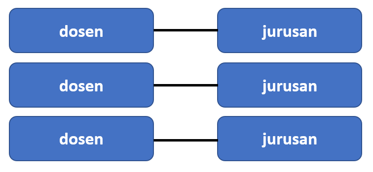

   Dalam bentuk tabel relasional, hasilnya adalah seperti ini:

   
   

2. **One to Many (1 to n)**
   Relasi database model  ini membolehkan data yang sama pada tabel kedua, tapi hanya membolehkan data yang bersifat unique (unik) pada tabel pertama. Jadi pada model tabel kedua boleh memiliki beberapa data yang sama.
   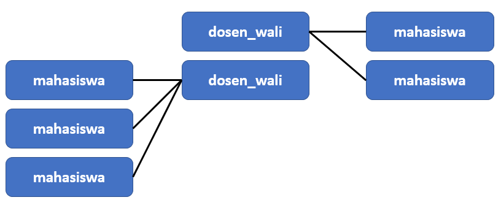

   Dalam bentuk tabel:
   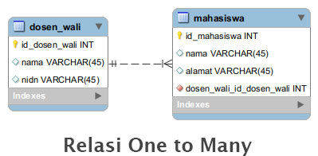

3. **Many to many (n to m)**
   Berbeda dengan kedua model diatas, relasi database model ini membolehkan beberapa data yang sama baik pada tabel pertama maupun tabel kedua. Dengan demikian tidak ada unique record di kedua tabel tersebut.
   

   Dalam bentuk tabel:
   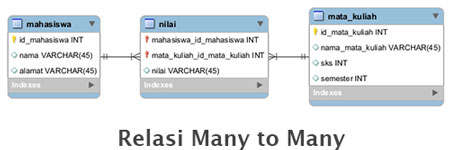

Apabila kita gambarkan hubungan yang kompleks antar semua entitas pada basisdata, kita akan memperoleh sebuah diagram yang disebut dengan **Diagram Entity Relationship (Diagram ER)**.


### Operasi pada Basisdata Relasional
Apabila kita menganggap basisdata sebagai sebuah kumpulan dari entitas yang saling terhubung, maka seperti halnya sebuah bilangan matematika, kita dapat menggunakan berbagai operasi pada entitas ini untuk memperoleh jawaban dari pertanyaan yang kita ajukan. Codd sendiri awalnya mendefinisikan delapan operasi berbeda, yang kemudian disebut dengan [Relational Algebra](https://www.geeksforgeeks.org/introduction-of-relational-algebra-in-dbms/). Relational Algebra merupakan bahasa prosedural yang menggunakan operator *unary* atau *binary* pada relasi atau tabel. Hasil dari Aljabar relasional ini adalah sebuah tabel lain yang menggambarkan hubungan dari kedua entitas.


```{figure} img/2020-12-08-00-41-03.png
---
height: 300px
name: relag
---
Relational Algebra pada Basisdata Relational
```

Pada sebuah RDBMS, operasi aljabar relasional ini diwujudkan menggunakan bahasa SQL, seperti yang akan dibahas sebagai berikut.


## Structured Query Language (SQL)
Apabila Anda menggunakan komputer untuk membuat basisdata pada contoh di awal bab ini, Anda akan dengan cepat menjawab pertanyaan yang diajukan sebelumnya. Apabila Anda mencari: ‘*Darimana saja asal pengungsi di posko A*?’, maka komputer akan langsung melihat tabel **Posko Pengungsi** untuk melihat nomor identifikasi masing-masing posko pengungsian, kemudian mencocokkannya dengan tabel **Asal Pengungsi **untuk melihat Desa apa saja yang ada di sana. Sekarang, bagaimana kita menanyakan pertanyaan seperti ini kepada komputer? 

Bagaimana kita membuat suatu sistem basisdata dan mengajukan pertanyaan (pertanyaan=‘QUERY’) kepada komputer agar kita memperoleh data yang kita inginkan? Untuk itulah kita akan mempelajari mengenai bahasa **SQL (Structured Query Language)**. Bahasa inilah yang akan kita gunakan untuk ‘bertanya’ atau mengajukan ‘query’ kepada komputer. Kita juga menggunakan bahasa SQL untuk menyelesaikan berbagai macam operasi pada aljabar relasional yang kita gunakan untuk mendapatkan jawaban dari pertanyaan yang kita inginkan.


### Bahasa SQL
**SQL** merupakan serangkaian perintah yang kita gunakan untuk membuat dan melakukan manajemen terhadap suatu basisdata di komputer. Misalnya, untuk membuat sebuah tabel seperti ini:

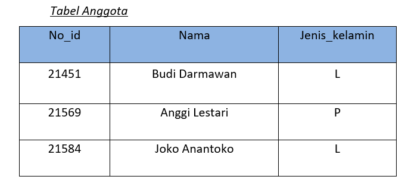

Dalam bahasa SQL akan tertulis seperti ini:

```sql
CREATE TABLE Anggota 
	(
	No_id INTEGER NOT NULL,
	nama VARCHAR(20),
	jenis_kelamin VARCHAR(2)
	);
INSERT INTO anggota VALUES ('21451', 'Budi Darmawan', 'L');
INSERT INTO anggota VALUES ('21569', 'Anggi Lestari', 'P');
INSERT INTO anggota VALUES ('21584', 'Joko Anantoko', 'L');
PRIMARY KEY no_id;
```

Berikut adalah penjelasan beberapa perintah dasar di atas:

   &nbsp;  
   
   ```sql
   CREATE TABLE Anggota (
   ```
   &nbsp;  
   * **CREATE TABLE** &nbsp;  
   Fungsi dari perintah ini adalah untuk membuat sebuah tabel baru, yang tentu saja isinya masih kosong. Untuk mengisi tabel yang baru dibuat ini kita gunakan perintah INSERT INTO dan VALUES seperti yang akan dijelaskan di bawah. 

   * **Anggota** &nbsp;  
   Adalah nama/judul dari tabel pertama yang akan kita buat pada basisdata ini. Judul tabel ini merupakan variable, artinya, Anda dapat menggunakan nama apapun yang Anda inginkan, asalkan merupakan satu buah kata (kita lihat, tanda spasi pada kata-kata ‘bidang tanah’ diganti dengan tanda underscore/garis bawah. Ini untuk menjaga variable tersebut hanya merupakan satu kata).

   &nbsp;  

   ```sql
	No_id INTEGER NOT NULL,
	nama VARCHAR(20),
	jenis_kelamin VARCHAR(2)
   ```

   &nbsp;  

   * **No_id, Nama dan Jenis_kelamin** &nbsp;  
   No_id merupakan nama kolom pertama yang kita isikan (lihat tabel pada contoh di atas agar lebih jelas). No_id ini adalah kolom yang akan kita fungsikan untuk memuat identitas unik masing-masing orang. Demikian pula, Nama dan Jenis_kelamin merupakan nama-nama kolom yang kita buat pada tabel anggota yang akan kita isi dengan keterangan-keterangan yang kita inginkan.

   * **Tipe Data** &nbsp;  
   INTEGER dan VARCHAR yang anda gunakan pada baris-baris perintah tadi berfungsi untuk menjelaskan tipe data dari kolom yang Anda buat. Berikut beberapa tipe data yang dapat anda gunakan:
      -	INTEGER		: Menyatakan data berupa bilangan bulat. Panjang data yang dapat dimuat adalah antara -2147483648 sampai 2147483647.
      -	FLOAT		: Menyatakan data berupa bilangan desimal
      -	VARCHAR	: Menyatakan sembarang karakter (huruf, angka, atau karakter yang lain). Apabila anda menambahkan bilangan dalam tanda kurung di belakangnya, misalnya VARCHAR(2), artinya anda membatasi maksimal hanya 2 karakter yang akan ditampilkan, tidak boleh lebih. 
      -	TEXT		: Menampilkan baris teks. Bedanya dengan tipe data character adalah panjang data yang bisa ditampung. Anda bisa memasukkan beberapa baris kalimat pada tipe data ini.
      -	DATE		: Memasukkan tanggal ke dalam kolom
      -	BOOLEAN	: Apabila anda memilih tipe data ini untuk sebuah kolom, artinya kolom tersebut hanya bisa memliki dua macam nilai: ‘TRUE’ atau ‘FALSE’. Biasanya tipe data ini digunakan untuk menyatakan pilihan.
   Perhatikan bahwa tiap kali anda membuat sebuah kolom, anda harus memisahkannya dengan baris perintah selanjutnya menggunakan tanda koma (,). Ini adalah salah satu aturan penulisan pada bahasa SQL.

   &nbsp;  
   ```sql
   PRIMARY KEY no_id;
   ```
   &nbsp;  
   * **PRIMARY KEY** &nbsp;  
   Pada baris perintah ini, kita memberi tahu komputer bahwa kolom No_id akan kita jadikan sebagai PRIMARY KEY. Primary key adalah kolom yang akan kita gunakan sebagai penghubung dengan tabel lain. Dalam hal ini, data yang berada pada kolom no_id haruslah bersifat unik. Artinya, data-data pada kolom ini harus berbeda antara satu dengan yang lainnya.


### Menggunakan Query untuk menanyakan pertanyaan pada Basisdata

Di atas kita telah melihat penjelasan bagaimana bahasa SQL digunakan untuk membuat sebuah tabel baru. Pada bagian ini kita akan menanyakan beberapa pertanyaan pada tabel tersebut.

Sekarang, dengan menggunakan tabel `anggota` di atas sebagai acuan, kita dapat menanyakan pertanyaan berikut:

```sql
SELECT * FROM anggota
```

SELECT dan FROM pada baris perintah di atas digunakan untuk menampilkan isi dari tabel yang dipanggil (pada contoh adalah tabel `anggota`). Tanda asterisk (*) di atas digunakan untuk menampilkan keseluruhan data pada semua kolom di tabel tersebut. Apabila anda memanggil perintah tersebut pada sebuah perangkat lunak basisdata (seperti PostgreSQL yang akan kita pelajari nanti), maka perintah tersebut akan menampilkan seluruh isi tabel anggota.

Perintah tersebut akan menampilkan semua isi kolom nama pada tabel anggota, seperti berikut:

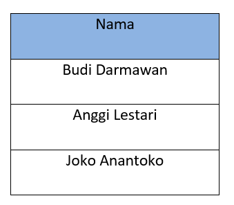

Apabila anda hanya ingin menampilkan satu baris tertentu, Anda dapat menggunakan perintah WHERE:

```sql
SELECT * FROM anggota WHERE No_id = 21451
```

hasilnya:


Apa keluaran dari bahasa SQL berikut?

```sql
SELECT nama FROM anggota WHERE jenis_kelamin = ‘L’
```

Sebuah perintah SQL dapat menjadi sangat kompleks: semakin rumit informasi yang ingin kita peroleh, semakin banyak relasi yang terlibat, maka akan semakin rumit pula Query yang harus kita ajukan. Meskipun demikian, SQL dapat memperoleh informasi yang cukup rumit hanya dengan beberapa perintah sederhana, sehingga sangat ideal untuk keperluan analisis data dalam jumlah besar, khususnya data spasial.

### DDL, DML, DCL dan TCL
Kita telah melihat beberapa perintah SQL yang dapat digunakan untuk 'bertanya' pada basisdata menggunakan Query tertentu. Perintah (*command*) dalam bahasa SQL seperti yang disebutkan di atas dapat dikelompokkan menjadi empat kelompok besar: *Data Definition Language* (DDL), *Data Manipulation Language* (DML), *Data Control Language* (DCL) dan *Transaction Control Language* (TCL). Keempat jenis perintah ini membagi bahasa SQL ke dalam jenis operasi yang dilakukan:

```{figure} img/2020-12-08-00-54-04.png
---
height: 300px
name: ddl
---
Perintah dalam bahasa SQL
```

Berikut penjelasan untuk tiap operasi:

* *Data Definition Language* (DDL)
  
  Perintah yang dikelompokkan sebagai DDL digunakan pada saat pembuatan skema dan pendefinisian basisdata, serta bagaimana data disimpan pada basidata.
  - CREATE - Digunakan untuk membuat basisdata baru serta objek-objek yang terdapat di dalamnya (TABLE, INDEX, VIEW, FUNCTION, dan sebagainya)
  - ALTER - Merubah struktur basidata dan objek di dalamnya
  - DROP - Menghapus basisdata atau objek di dalamnya
  - TRUNCATE - Menghapus semua *record* pada basisdata
  - RENAME - Mengganti nama sebuah objek basisdata
  
* *Data Manipulation Language* (DML)
  
  DML terdiri dari sebagian besar perintah yang kita gunakan pada sebuah basisdata. DML berkaitan dengan manipulasi data dan objek pada basisdata, termasuk untuk menyimpan, memodifikasi, mengambil data, menghapus dan memperbarui data pada basisdata. 
  - SELECT - Digunakan untuk memilih dan mengambil data dari basisdata berdasarkan kriteria tertentu
  - INSERT - Digunakan untuk memasukkan data ke dalam relasi
  - UPDATE - Memungkinkan pengubahan nilai dari beberapa atribut dalam tupel yang ada.
  - DELETE - Digunakan untuk menghapus tupel dari tabel.
  - MERGE - Menggabungkan data baru pada data yang sudah ada
  
  Penggunaan tiap perintah di atas akan dikontrol oleh CONSTRAINT yang telah ditetapkan pada relasi atau basisdata tersebut. Contoh konstrain yang diterapkan pada basisdata adalah pembatasan tipe data pada kolom sebuah tabel.

  Berikut adalah contoh dari penggunaan perintah DML:

  **Insert Operation**

  Operasi Insert menambahkan data baru pada sebuah tabel sesuai dengan kolom yang tersedia

  

  **Update Operation**

  Pada tabel di bawah, status `CustomerName=Apple` berubah dari `inactive` menjadi `active`

  

  **Delete Operation**
  Pada operasi penghapusan, suatu kriteria diberikan melalui Query untuk 
  

  **Select Operation**

  Operasi berikut memilih Customer dengan nama "Amazon"
  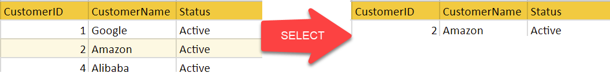

* *Data Control Language* (DCL)
  
  Perintah pada DCL sebagian besar terkait dengan pemberian hak, permission, dan pengaturan kontrol lain pada basisdata.
  - GRANT - Memberikan hak dan izin (*Priviledges*) kepada pengguna untuk mengakses sebuah basisdat
  - REVOKE - Menghilangkan hak pada pengguna

* *Transaction Control Language* (TCL)
  
  TCL digunakan untuk mengatur transaksi pada sebuah basisdata, yaitu: 
  - COMMIT - menyimpan operasi transaksi
  - ROLLBACK - kembali pada rekaman transaksi sebelumnya pada saat terjadi kesalahan
  - SET TRANSACTION - mendefinisikan karakteristik transaksi


Setelah ini, kita akan menggunakan PostgreSQL untuk melakukan Query menggunakan Bahasa SQL. Terlebih dahulu lakukan instalasi sesuai dengan panduan yang diberikan sebagai berikut.

## Instalasi dan Pengaturan Basisdata PostgreSQL
PostgreSQL merupakan perangkat lunak yang digunakan untuk melakukan manajemen basisdata, sedangkan PostGIS merupakan perangkat lunak tambahan (‘Plugin’) pada PostgreSQL yang digunakan untuk menambahkan fungsi keruangan (spasial) pada PostgreSQL. Pada bagian ini diuraikan cara membuat basisdata dengan menggunakan PostgreSQL/PostGIS, dengan lebih dahulu membahas mengenai instalasi PostgreSQL dan PostGIS menggunakan Docker.

### Latihan: Instalasi dan Pengaturan Docker
Pada latihan ini akan dibahas mengenai instalasi Docker. Docker nantinya akan kita gunakan sebagai Container untuk mempermudah instalasi PostgreSQL dan PostGIS. Arsitektur Docker adalah sebagai berikut:


Langkah berikut merujuk pada [Panduan Resmi Instalasi Docker](https://docs.docker.com/engine/install/ubuntu/):

1. Lakukan update, kemudian lakukan instalasi beberapa dependencies untuk Docker
   ```bash
   sudo apt-get install \
    apt-transport-https \
    ca-certificates \
    curl \
    gnupg-agent \
    software-properties-common
   ```
2. Tambahkan GPG official untuk Docker:
   ```bash
   curl -fsSL https://download.docker.com/linux/ubuntu/gpg | sudo apt-key add -
   ```
3. Periksa  fingerprint untuk GPG yang telah ditambahkan ke Ubuntu
   ```bash
   sudo apt-key fingerprint 0EBFCD88
   ```
4. Tambahkan repository baru. Docker memiliki repository tersendiri sehingga perlu memberi tahu apt untuk mengambil instalasi dari repository ini:
   ```bash
   sudo add-apt-repository \
    "deb [arch=amd64] https://download.docker.com/linux/ubuntu \
    $(lsb_release -cs) \
    stable"
   ```
5. Update kembali apt:
   ```bash
   sudo apt-get update
   sudo apt-get install docker-ce docker-ce-cli containerd.io
   ```
6. Uji apakah docker sudah berhasil diinstall
   ```bash
   sudo docker run hello-world
   ```
7. Memasukkan user ke dalam grup `docker`. [Langkah ini](https://docs.docker.com/engine/install/linux-postinstall/#manage-docker-as-a-non-root-user) perlu untuk menghilangkan `sudo` pada perintah untuk memanggil docker.
   ```bash
   sudo usermod -aG docker $USER
   newgrp docker 
   ```


```{admonition} Catatan
Docker memerlukan Systemd untuk menjalankan servicenya, sama seperti Tomcat pada materi sebelumnya. Untuk itu, apabila muncul pesan kesalahan terkait `systemd` atau `systemctl` pada WSL, coba kembali langkah-langkah untuk mengkoreksi system seperti yang telah disebutkan sebelumnya.
```

Setelah instalasi Docker berhasil, selanjutnya adalah menggunakan Docker untuk melakukan instalasi Image untuk PostGIS. Image adalah paket aplikasi yang dibuat oleh developer untuk memuat serangkaian perintah dan dapat diduplikasi oleh siapapun yang menghendaki. Image pada Docker tersimpan pada Docker Hub sebagai satu repository tempat Image dibagikan:


### Latihan: Memulai Docker untuk PostGIS
Untuk keperluan latihan ini kita akan menggunakan Image PostGIS yang dibuat oleh [Kartoza](https://github.com/kartoza/docker-postgis). Sebenarnya, terdapat banyak Image yang sudah dibuat oleh banyak developer. Kita dapat mencari Image terkait PostGIS menggunakan perintah 'search' pada Docker:

```bash
docker search postgis
```

hasilnya:


Image PostGIS yang dibuat oleh tim Kartoza dapat dijumpai pada Docker Hub sebagai berikut: 
https://hub.docker.com/r/kartoza/postgis/

Berikut adalah langkah instalasi Image PostGIS dengan Docker [^footnote6]:

[^footnote6]:https://alexurquhart.com/post/set-up-postgis-with-docker/

1. Membuat Persistance Volume.
   Persistance Volume digunakan agar Docker menyimpan berkas pada lokasi yang dapat diakses, yaitu pada mesin WSL. Berikut perintahnya:

   ```bash
   docker volume create pg_data
   ```
2. Untuk menginstall PostGIS kita gunakan perintah berikut:
   ```bash
   docker run --name=postgis -d -e POSTGRES_USER=postgres -e POSTGRES_PASS=postgres -e POSTGRES_DBNAME=gis -e ALLOW_IP_RANGE=0.0.0.0/0 -p 5432:5432 -v pg_data:/var/lib/postgresql --restart=always kartoza/postgis:13.0
   ```
   * docker run --name = postgis memberi tahu Docker bahwa container baru kami akan diberi nama postgis
   * -d menjalankan kontainer di latar belakang (mode terpisah)
   * -e POSTGRES_USER = postgres the -eflag menyetel variabel lingkungan di dalam penampung. Yang ini digunakan untuk mengonfigurasi nama peran login di PostgreSQL yang akan memiliki hak superuser (admin) di database. Anda dapat mengubah nama ini menjadi apa pun yang Anda inginkan.
   * -e POSTGRES_PASS = postgres menyetel variabel lingkungan yang akan menyetel kata sandi peran login menjadi `kata sandi. Anda dapat mengatur ini menjadi apa pun yang Anda inginkan.
   * -e POSTGRES_DBNAME = gis seperti yang bisa Anda tebak, variabel lingkungan memberi tahu container untuk membuat database baru di server dengan nama gis. Setelah database dibuat maka extension PostGIS akan diaktifkan di dalamnya.
   * -e ALLOW_IP_RANGE = 0.0.0.0 / 0 memberi tahu container untuk mengkonfigurasi PostgreSQL untuk menerima koneksi dari siapa pun. Jika Anda tidak mengatur ini maka database hanya akan menerima koneksi dari alamat menggunakan subnet jaringan Docker.
   * -p 5432: 5432 memetakan port 5432 pada VM host ke port 5432 pada container. Ini diperlukan karena server database mendengarkan koneksi pada port 5432 secara default.
   * -v pg_data: / var / lib / postgresql memberi tahu sistem file container untuk memasang volume pg_data yang baru saja kita buat ke jalur / var / lib / postgresql. Ini berarti bahwa data apa pun yang disimpan atau dibuat container di direktori itu akan disimpan dalam volume pg_data.
   * --restart = selalu membuat kebijakan restart untuk penampung Anda. Sekarang penampung Anda akan mulai setiap kali mesin virtual Docker dimulai. Jika ini tidak disetel, Anda harus memulai penampung secara manual setiap kali VM di-boot dengan docker start postgis
   * kartoza / postgis: 13.0 memberitahu Docker untuk menarik repositori kartoza / postgis dari Docker Hub, menggunakan PostgreSQL versi 9.6 dan PostGIS versi 2.4. Anda dapat melihat versi lain yang tersedia di [sini](https://hub.docker.com/r/kartoza/postgis/tags/?page=1&ordering=last_updated)

3. Tunggu sampai instalasi selesai. Periksa apakah mesin yang digunakan sudah menyala menggunakan perintah:
   ```bash
   docker ps
   ```

Selanjutnya, PostGIS dan PostgreSQL siap untuk digunakan.

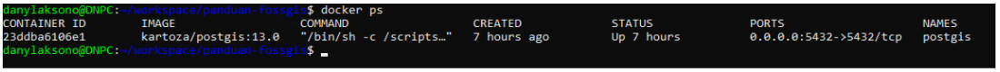

&nbsp;  

## Menggunakan Query SQL pada Basisdata

Untuk mengirimkan SQL pada Basisdata PostgreSQL dapat digunakan beberapa aplikasi antarmuka yang berbeda. `psql` dan `pgAdmin` barangkali merupakan antarmuka untuk basisdata PostgreSQL yang paling terkenal. Sejatinya, koneksi pada basisdata dapat dilakukan pada berbagai aplikasi, dengan syarat terdapat port dan host yang terbuka untuk melakukan koneksi pada PostgreSQL seperti yang akan kita lakukan nanti dengan QGIS. Untuk memulai, terlebih dahulu akan kita gunakan kedua aplikasi yang telah disebutkan di atas.

### Latihan: Menggunakan `psql` untuk melakukan query sederhana
`psql` merupakan aplikasi untuk manajemen client postgreSQL. Dengan aplikasi ini, script SQL dapat dibuat melalui *command prompt*. Contohnya, koneksi pada basisdata dapat dilakukan sebagai berikut:

```bash
psql -d database -h host -U  user -W
```

Aplikasi ini tersedia bersama dengan instalasi PostgreSQL dan PostGIS yang sudah kita install menggunakan **Docker Kartoza**. Dalam hal ini, aplikasi ini sekarang tersimpan di dalam mesin Docker, dan bukan pada WSL, sehingga kita perlu melakukan [langkah tambahan](https://github.com/gis-ops/tutorials/blob/postgrest-elevation-api/postgres/postgres_postgis_postgrest_installation.md) untuk melakukan akses tersebut:

1. Masuk ke dalam Docker menggunakan perintah `docker exec`
   ```bash
   docker exec -it postgis bash
   ```
2. Install text editor, misalnya **nano**:
   ```bash
   apt-get update && apt-get install nano
   ```
3. Masuk ke folder instalasi PostgreSQL
   ```bash
   cd /etc/postgresql/13/main/
   ```
4. Dengan menggunakan **nano**, lakukan editing pada file `pg_hba.conf`. Ubah `peer` menjadi `trust` pada **Database administrative login by Unix domain socket** seperti berikut: 
   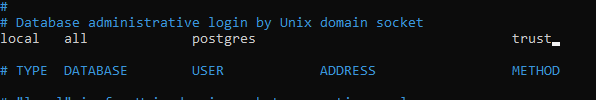  
5. Keluar dari mesin dan lakukan restart untuk kontainer PostGIS
   ```bash
   docker restart postgis
   ```
6. Gunakan `psql` seperti berikut:
   ```bash
   docker exec -it postgis psql -U postgres
   ```
   maka kita akan masuk ke shell untuk `psql`:
   

7. Pada shell ini kita dapat langsung mengetikkan Query yang kita inginkan, misalnya:
   ```postgres=# SELECT * FROM anggota;```
8. Selain melalui konsol, kita juga dapat membuat query menggunakan *command*, seperti berikut:
   ```
   docker exec -it postgis psql -U postgres -d latihan -c 'SELECT * FROM anggota'
   ```

```{admonition} Catatan
Tentunya untuk kedua contoh SELECT di atas, basisdata `latihan` dan tabel `anggota` harus sudah tersedia terlebih dahulu.
```


Untuk latihan ini, coba gunakan query pada tabel `anggota` seperti di atas menggunakan `psql`, yaitu dari pembuatan tabel hingga mengajukan pertanyaan. Buat basisdata baru dengan nama `Latihan`, kemudian masukkan tabel `anggota`. Gunakan perintah-perintah DDL dan DML untuk membuat dan mengoperasikan basisdata ini melalui `psql`.

Daftar [perintah](https://gist.github.com/Kartones/dd3ff5ec5ea238d4c546) untuk `psql` dapat dilihat pada:
https://www.postgresqltutorial.com/postgresql-cheat-sheet/.


### Latihan: Menggunakan pgAdmin sebagai GUI Basisdata PostgreSQL
Pada bagian ini, **pgAdmin4** akan digunakan sebagai antarmuka untuk PostgreSQL. pgAdmin merupakan antarmuka PostgreSQL yang menyediakan GUI (*Graphical User Interface*) sehingga memudahkan untuk mengajukan Query, memanajemen basisdata, memonitor transaksi, dan seterusnya.


Terlebih dahulu unduh pgAdmin4 dari alamat berikut:
https://www.pgadmin.org/download/

&nbsp;  
Selanjutnya, lakukan instalasi pada sistem operasi Windows. Tampilan **pgAdmin4** setelah instalasi adalah sebagai berikut:
&nbsp;  


&nbsp;  
Koneksi dapat dilakukan pada basisdata melalui pgAdmin4 sebagai berikut. Klik kanan pada `Server`, kemudian pilih `Create Server`.


Masukkan nama dan parameter koneksi seperti contoh berikut:

&nbsp;  


&nbsp;  
dimana *alamat host* adalah ip address yang digunakan oleh mesin Docker. 
&nbsp;  

&nbsp;  
untuk mendapatkan alamat tersebut, gunakan perintah:

```bash
ip addr
```

kemudian lihat ip address untuk `eth0`. Alamat ini adalah alamat IP yang digunakan oleh Windows untuk berkomunikasi dengan WSL, sehingga kita dapat menggunakannya untuk terhubung dengan PostgreSQL. Pada kasus instalasi PostgreSQL langsung di mesin server, alamat yang dicari ini dapat dibuat cukup dengan menggunakan `localhost` saja. Diagram berikut menggambarkan bagaimana Windows terhubung pada WSL dengan menggunakan koneksi melalui IP Address yang dimaksud.

```{figure} img/2020-12-03-09-00-55.png
---
height: 300px
name: table2
---
Koneksi pada WSL
```


Setelah terhubung, PostgreSQL akan menampilkan beberapa menu yang dapat digunakan untuk melakukan manajemen basisdata. Untuk melakukan Query pada basisdata tertentu, klik pada basisdata tersebut, kemudian gunakan menu `Query Tool` untuk membuat query terhadap basisdata ini. 


Perintah SQL seperti yang kita sebutkan di atas dapat digunakan pada jendela Query yang tersedia.

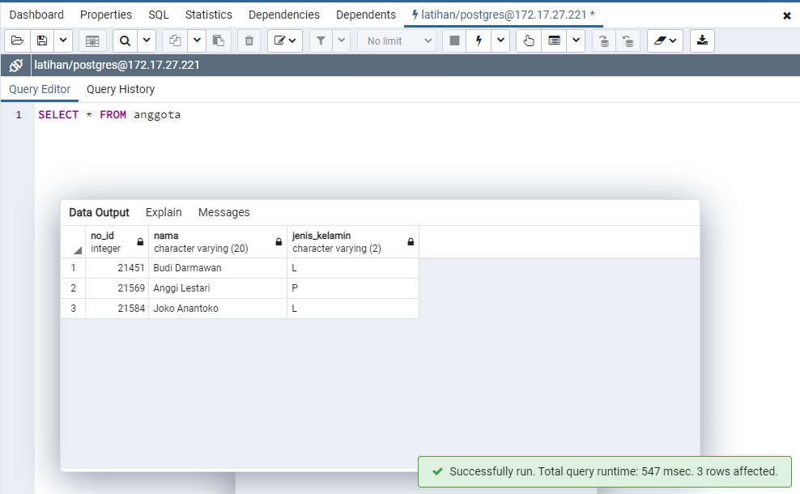


```{admonition} Catatan

Mesin Docker PostGIS yang kita panggil pada WSL akan tetap berjalan sampai kita matikan. Untuk memeriksa mesin apa saja yang sedang berjalan, kita dapat gunakan:

   ```bash
   docker ps
   ```

Maka Docker akan menampilkan daftar mesin yang sedang berjalan. Untuk menghentikan semua mesin, kita gunakan perintah:

   ```bash
   docker stop $(docker ps -aq)
   ```

dan untuk memulai kembali mesin tersebut, cukup panggil dengan menggunakan:
   ```bash
   docker start postgis
   ```

 dimana `postgis` adalah nama mesin yang kita definisikan menggunakan parameter `--name` pada saat memanggil image ini. Dalam hal ini Docker tidak akan mengunduh instalasi baru karena berkas tersebut masih ada pada WSL.
```


