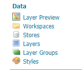
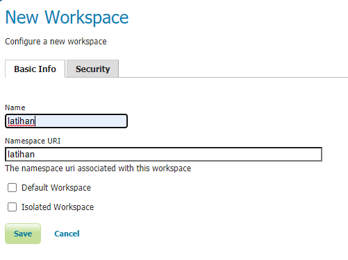
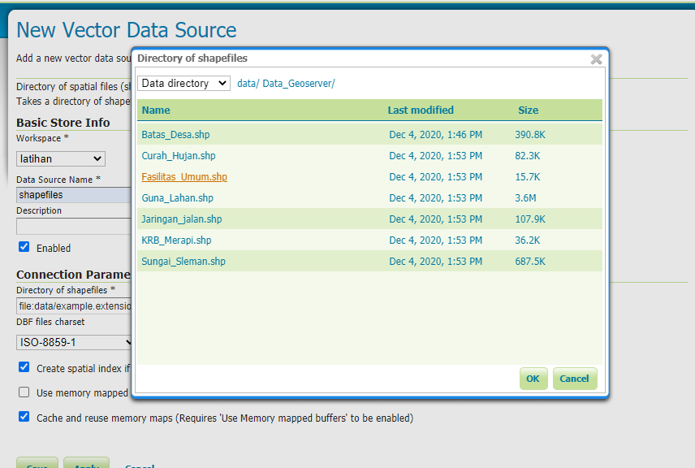
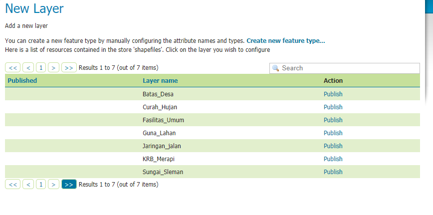
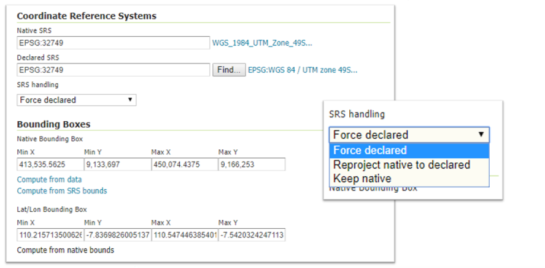
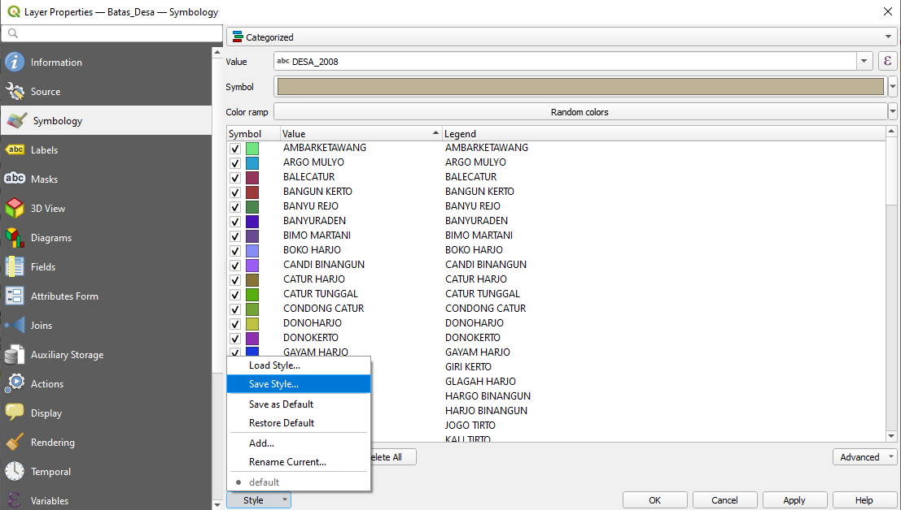

# Publikasi Data Spasial dengan Geoserver

Web Map Server merupakan program komputer yang menghasilkan peta data yang direferensikan secara spasial dari
data dan informasi geografis. Aplikasi ini, sebagaimana dibahas sebelumnya, adalah antarmuka sederhana yang menyajikan data dalam format standar untuk ditampilkan pada aplikasi berbasis web. Berbagai protokol melibatkan sintaks kueri untuk memposting meminta layer yang diinginkan dan memperbesar jendela ke server, yang menghasilkan peta sebagai image dalam format standar (GIF, PNG atau format lain) atau sebagai format vektor (misalnya KML, GML). Data ini kemudian dapat dikonsumsi oleh berbagai client. Pada bagian ini akan dibahas mengenai bagaimana melakukan publikasi data spasial dengan Geoserver.

## Menghubungkan Geoserver dengan Data
Geoserver mengenali berbagai jenis data spasial. Adapun urutan untuk melakukan publikasi data pada Geoserver adalah sebagai berikut:
1. Buat **Workspace** baru (workspace ≈ nama project)
2. Buat **Store** baru sesuai jenis data (vector/raster/cascading). Pilih workspace yang telah dibuat
3. **Publish layer** dengan mengatur extent, proyeksi dan styling
4. Atur **Style** apabila diperlukan
5. Uji Layanan Layer dengan menggunakan **Layer Preview**

Langkah tersebut dapat diikuti sesuai urutan pada antarmuka Geoserver berikut:


Berikut adalah daftar datastore yang didukung oleh Geoserver pada instalasi defaultnya:


Dengan menggunakan ekstensi, daftar tersebut dapat berkembang menjadi lebih banyak. Silahkan mengacu pada halaman [ekstensi Geoserver](https://docs.geoserver.org/stable/en/user/extensions/index.html) maupun [modul komunitas](https://docs.geoserver.org/stable/en/user/community/index.html) untuk melihat opsi yang tersedia.


### Latihan: Mengunggah Shapefile
Geoserver membaca data yang disimpan pada Environment variable `GEOSERVER_DATA_DIR`, sehingga untuk melakukan ini, kita perlu mengcopy shapefile yang akan diunggah ke dalam folder tersebut. Lokasi folder ini dapat dilihat pada bagian data directory di server status:


Pada gambar di atas, folder Data Directory adalah `/opt/tomcat/apache-tomcat-9.0.40/webapps/geoserver/data`.

Masih dengan data latihan sebelumnya, kita akan gunakan layer-layer tersebut untuk mengunggah data pada Geoserver.

1. Dengan menggunakan koneksi WSL ke Windows Explorer, copykan data yang akan kita unggah ke folder di dalam WSL, misalnya `home directory` kita. Ingat, wsl dapat dibuka dari Windows Explorer menggunakan `\\wsl$`. 
   
   

2. Dari WSL, copykan data tersebut ke folder `GEOSERVER_DATA_DIR` yang kita catat sebelumnya. Gunakan perintah `cp` untuk mengcopy berkas ke folder yang dimaksud.
   
   ```bash
   sudo cp -a Data_Geoserver/ "/opt/tomcat/apache-tomcat-9.0.40/webapps/geoserver/data/shpsleman/" 
   ```

Pada Geoserver, kita dapat memanggil layer tersebut pada saat publikasi layer. Pembahasan mengenai publikasi layer adalah sebagai berikut.

### Latihan: Melakukan Publikasi dari Shapefile
Setelah kita memiliki shapefile pada server, berkas tersebut perlu dipublikasi agar dapat diakses menggunakan Standar OGC. Berikut langkah untuk melakukan publikasi data pada Geoserver:

1. Membuat Workspace. Workspace pada Geoserver dapat dianggap sebagai sebuah project yang didalamnya berisi beberapa layer sekaligus. Untuk membuat workspace, gunakan menu `Workspace` pada bagian kiri dari halaman Geoserver, kemudian Klik `Add New Workspace`.
   
   

   Berikan nama dan URI pada workspace tersebut. URI digunakan sebagai identitas pada saat layer yang tersimpan di dalam workspace tersebut dipanggil nantinya. Klik `Save` untuk menyimpan workspace

2. Berpindah ke langkah selanjutnya, kita akan menghubungkan Geoserver dengan data pada direktori. Gunakan menu `Stores` untuk menyimpan dan menghubungkan satu atau beberapa layer dengan menggunakan Geoserver. Klik pada `Add New Store` untuk menghubungkan sumber data baru. Karena kita akan menambahkan beberapa **Shapefile** sekaligus, gunakan pilihan `Directory of Spatial Files (shapefiles)` seperti berikut:
   
   

   klik OK untuk konfirmasi penambahan **Store**
   
3. Geoserver akan secara otomatis mengarahkan kita ke halaman layer. Selanjutnya adalah menggunakan menu 'Publish` pada halaman tersebut untuk mempublikasikan data
   
   
   
   
4. Pada saat publikasi, hal yang harus diperhatikan adalah pengaturan **sistem proyeksi** dan **extent**. Pengaturan ini dapat dijumpai pada bagian akhir di halaman publikasi:
   
   

   Terdapat tiga pengaturan penggunaan sistem proyeksi yang ada pada Geoserver:
   * **Force Declared**, abaikan sistem proyeksi asli dari layer, dan berikan definisi sistem proyeksi baru pada layer tersebut. Ini dapat digunakan apabila sistem proyeksi asli dari layer hilang atau rusak, misalnya pada berkas dengan tipe *shapefile* (prj). Tool ini sama seperti *Define Projection* pada perangkat desktop
   * **Reproject Native to Declared**, digunakan untuk melakukan transformasi sistem proyeksi, misalnya dari sistem proyeksi UTM-49S (EPSG:32749) menjadi sistem proyeksi geografis (EPSG:4326). Ini sama seperti tool *Reproject* pada perangkat lunak GIS desktop
   * **Keep Native**, abaikan sistem proyeksi yang didefinisikan oleh Geoserver, dan gunakan sistem proyeksi asli yang terdapat pada data. Ini dapat dipilih, sebagai contoh, pada saat melakukan publikasi peta dengan sistem proyeksi lokal

5. Untuk menguji apakah layer sudah sesuai dengan keinginan, gunakan menu `Layer Preview` pada Geoserver
   
   

   Pada bagian ini, dapat diperiksa apakah pemanggilan WMS dan WFS untuk layer yang dipublikasi sudah sesuai. Demikian pula, dapat diperiksa mengenai kesesuaian bounding box dan sistem proyeksi yang digunakan.
   

Setelah publikasi, pengaturan yang diperlukan adalah pembuatan style serta pengaturan keamanan apabila diperlukan. Bagian akhir dari bab ini membahas mengenai pengaturan style pada layer yang dapat digunakan untuk WMS pada Geoserver.


### Latihan: Menghubungkan Geoserver dan Basisdata PostGIS
PostGIS dapat dihubungkan melalui antarmuka Geoserver. Berikut adalah tampilan antarmuka dan parameter koneksinya:


Sama seperti pada QGIS, koneksi ke PostGIS dari Geoserver juga menggunakan parameter seperti Host, Username, Basisdata dan Password.

Setelah terkoneksi sebagai `store`, layer pada store tersebut juga dapat ditambahkan pada Geoserver melalui Publikasi sebagaimana pada layer yang dipublikasi menggunakan Shapefile. Penggunaan PostGIS dalam hal ini memiliki beberapa keuntungan, diantaranya adalah:
* Keamanan data yang lebih baik, karena akses pada data dibatasi oleh Geoserver dan PostGIS sekaligus
* Manajemen data yang fleksibel. Dengan menggunakan PostGIS, akses terhadap data dapat diatur menggunakan aplikasi framework di luar Geoserver, seperti menggunakan Laravel atau NodeJS.
* [SQL View](https://geoserver.geo-solutions.it/educational/en/adding_data/add_sqllayers.html), merupakan cara untuk memanggil layer menggunakan parameter. Sebagai contoh, kita dapat memanggil hanya layer titik yang dipilih oleh pengguna melalui bounding box, misalnya.


### Latihan: Publikasi Data melalui REST-API Geoserver
Pada remote server, seringkali kita tidak dapat menggunakan antarmuka yang memungkinkan untuk publikasi data secara langsung. Boleh jadi kita tidak dapat menggunakan console pada server untuk mengcopy data pada folder Data Directory seperti yang kita lakukan sebelumnya. Dengan demikian, interaksi pada Geoserver juga menjadi terbatas. Untuk itu, Geoserver menyediakan REST API yang dapat digunakan untuk berinteraksi dengan fungsi-fungsi Geoserver melalui antar muka API standard. API ini dapat diakses melalui http://alamatgeoserver:8080/geoserver/**rest**/workspaces.

Berikut adalah langkah untuk mengunggah file pada server:
1. Membuat Workspace baru dengan nama `latihan` (lewati jika Workspace sudah tersedia)
   
   ```bash
   curl -v -u admin:password -XPOST -H "Content-type: text/xml"  -d "<workspace><name>latihan</name></workspace>" http://alamatgeoserver:8080/geoserver/**rest**/workspaces
   ```

2. Mengunggah file `jalan.zip` sebagai layer baru pada workspace `latihan` dengan nama datastore `jalan`
   
   ```bash
   curl -v -u admin:geoserver -XPUT -H "Content-type: application/zip" --data-binary @jalan.zip http://54.254.9.31:8080/geoserver/rest/workspaces/latihan/datastores/jalan/file.shp
   ```

Dengan cara seperti ini, kita dapat mengunggah layer dengan format shapefile sebagai layer pada Geoserver meskipun kita tidak memiliki akses pada server tersebut secara langsung.


## Styling Publikasi dengan SLD
Protokol WMS yang digunakan pada Geoserver memerlukan styling sebelum disajikan pada client. Format yang digunakan oleh Geoserver adalah SLD (*Style Layer Descriptor*). Antarmuka untuk pengaturan SLD adalah sebagai berikut:


SLD menggunakan format XML untuk menyimpan style. Untuk memudahkan styling, dapat digunakan QGIS untuk menyimpan simbolosasi yang diinginkan. Berikut adalah menu untuk melakukan *export*  Style yang dapat dilakukan pada QGIS:

1. Pada Properti layer di QGIS, buka simbologi, kemudian buat simbol sesuai dengan style yang diinginkan
   
   

   Klik pada `Style > Save Style` untuk membuka kotak dialog penyimpanan style tersebut. 

2. Simpan style tersebut sebagai SLD. File inilah yang nanti akan diunggah pada antarmuka SLD di Geoserver seperti di atas
   
   


Hasil publikasi dapat dikonsumsi oleh perangkat client seperti QGIS atau LeafletJS melalui alamat publikasi masing-masing layer sesuai standar OGC. Pembahasan ini akan diberikan pada bab selanjutnya.

   
   
